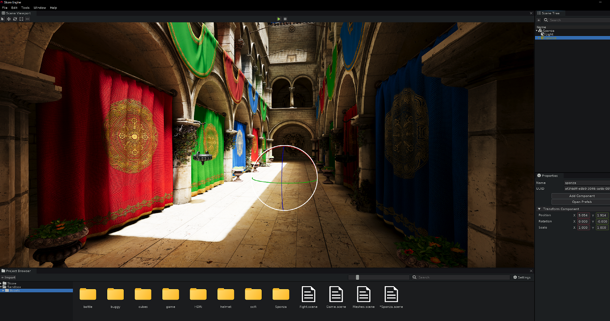

# Skore Engine

[![The MIT License][license-image]][license-url]
[](https://isocpp.org/)
[](https://en.cppreference.com/w/cpp/20)

## Overview

Skore is an open-source, multi-platform 2D and 3D game engine designed with simplicity and performance in mind. Built with modern C++20, it aims to provide game developers with a powerful yet easy-to-use toolkit for creating games across multiple platforms.

[license-image]: https://img.shields.io/badge/License-MIT-yellow.svg
[license-url]: https://opensource.org/licenses/MIT



## Important Note

> ⚠️ Skore is currently under active development and should be considered alpha software. The API may change significantly between versions, and some planned features are not yet implemented. Not recommended for production use at this time.

## Core Principles

The development of Skore is guided by the following principles:

- **Simplicity First**: Easy to use, straightforward API with no hidden complexities or tedious configuration steps
- **Lightweight Design**: Carefully selected dependencies with minimal footprint to keep the engine lean and efficient
- **Hassle-Free Building**: Simple build process with no extra steps - just clone and build
- **Extensibility**: Features can be replaced or extended without modifying engine source code
- **Clean API Design**: Minimal external dependencies in public headers, providing full control over the API surface

## Current Features

### Core Systems
- 📦 Robust Entity System
- 🧩 Comprehensive Asset Management
- 🔄 Runtime Reflection System
- 📚 Custom STL-compatible Container Types
- ↩️ Complete Undo/Redo System for Assets and Entities

### Graphics & Rendering
- 🎮 Advanced 3D Renderer with PBR Materials
- 🌓 Cascade Shadow Mapping
- 🌌 HDR Sky Rendering
- ⚡ Vulkan Rendering Hardware Interface
- 🖍️ HLSL Shader Support

### Physics & Gameplay
- 🔌 C++ Plugin-based Scripting (no engine recompilation needed)

### Tools & Platform Support
- 🔧 Integrated Editor Environment with Full Undo/Redo History
- 💻 Cross-platform Support (Windows, Linux, macOS)

## Roadmap

The following features are planned for future releases:

### Coming Soon
- 🔋 3D Physics powered by Jolt Physics
- 📊 Fully Customizable Render Graph
- 🎭 Animation System
- 🎵 Audio Engine
- 🎮 Game UI Framework
- 📱 Mobile Device Support (Android, iOS)

### On the Horizon
- 🖼️ Dedicated 2D Renderer
- 🧲 2D Physics System
- 🌐 Networking Layer
- 🧠 AI Tools & Systems

We welcome community input on prioritizing these features! Feel free to open an issue to discuss.

## Building from Source

### Prerequisites

- **CMake** 3.20 or higher
- **C++20 compatible compiler**:
  - Windows: Visual Studio 2019 or newer
  - macOS: Xcode 13+ or AppleClang 13+
  - Linux: GCC 10+ or Clang 12+

### Platform-Specific Dependencies

- **Linux**: Install the following packages:
  ```bash
  sudo apt install xorg-dev libglu1-mesa-dev libgtk-3-dev
  ```
- **Windows/macOS**: No additional dependencies required

### Build Steps

```bash
# Clone the repository
git clone https://github.com/SkoreEngine/Skore.git
cd Skore

# Create and navigate to build directory
mkdir Build && cd Build

# Configure CMake
cmake ..

# Build the engine
cmake --build . --config Release
```

## Getting Started

After building, you can start using Skore Engine in your projects:

1. Launch the Skore Editor from the build directory
2. Create a new project or open an example project
3. Check out the `Tests` directory for code examples

## Documentation

Comprehensive documentation is in development. In the meantime, code examples in the `Tests` directory provide valuable insights into engine usage.

## Contributing

Contributions are welcome! Whether you're fixing bugs, improving documentation, or proposing new features, please feel free to submit a pull request.

1. Fork the repository
2. Create your feature branch (`git checkout -b feature/amazing-feature`)
3. Commit your changes (`git commit -m 'Add some amazing feature'`)
4. Push to the branch (`git push origin feature/amazing-feature`)
5. Open a Pull Request

## License

Skore Engine is licensed under the MIT License. See the [LICENSE](LICENSE) file for details.