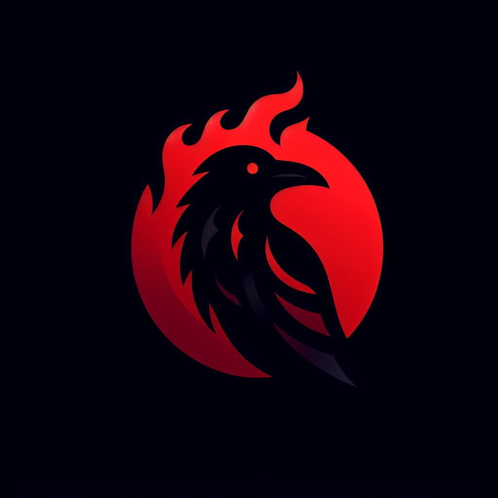

  

<h1 align="center">Skore Engine</h1>

  A modern C++ game engine for building real-time interactive worlds.

  
  
  
  

  

Skore is an open-source game engine and editor project shaped around a simple idea: making game creation feel direct, capable, and enjoyable from the first scene to the final build.

The engine is currently in early development. Its tools, APIs, project format, and workflows are still evolving, so expect change as the project grows. The goal is to build a clear and expressive foundation for games, experiments, simulations, and interactive applications.

## About

Skore is developed as a native engine with a focus on responsive editing, real-time rendering, and a runtime that stays close to the needs of the project being made. It is a place for exploring engine architecture, editor tooling, and the craft of building interactive software.

## Roadmap

Follow the public [Skore Roadmap](https://trello.com/b/345PmeGL/skore-roadmap) to see what is planned, in progress, and recently completed.

## Community

Skore is still young, and feedback is especially valuable while the foundations are being shaped. If you try the engine, run into problems, or have ideas for the editor and runtime, please open a [GitHub issue](https://github.com/SkoreEngine/Skore/issues) so the discussion stays visible and easy to track.

## Contributing

Contributions are welcome. Focused bug reports, small fixes, documentation improvements, tests, and thoughtful engine or editor changes all help the project move forward. For larger changes, check the [roadmap](https://trello.com/b/345PmeGL/skore-roadmap) first or start a discussion in an issue before opening a pull request.

## License

Skore Engine is released under the [MIT License](LICENSE).

## Credits

The showcase scene above uses the [Apocalyptic Hospital](https://www.fab.com/listings/84e5ee9c-1b14-4cd3-b4c3-731117221e1c) environment by [Meshingun Studio](https://www.fab.com/sellers/Meshingun%20Studio) on Fab. Third-party assets shown in screenshots remain the property of their respective owners and are not covered by the Skore Engine license.
