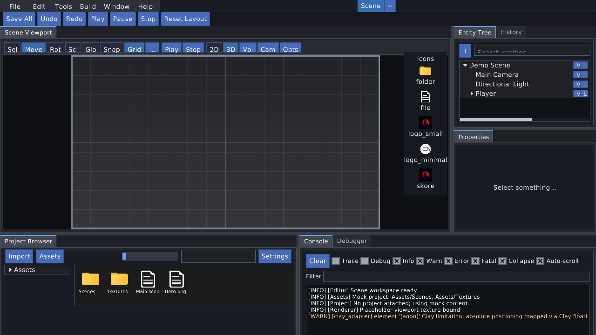
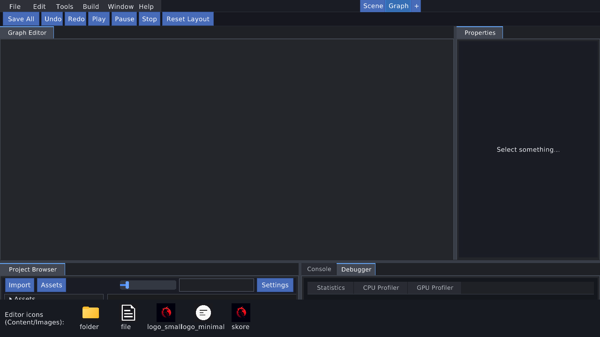
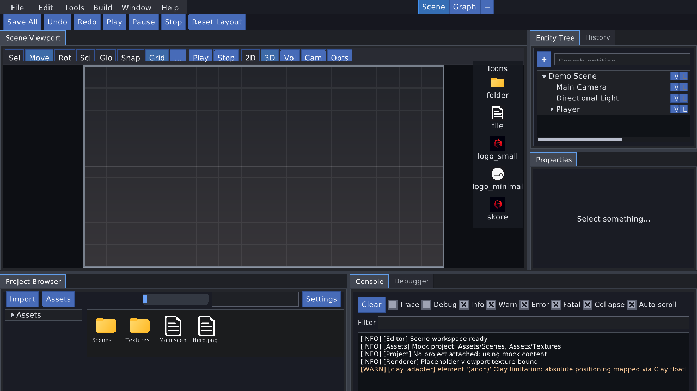
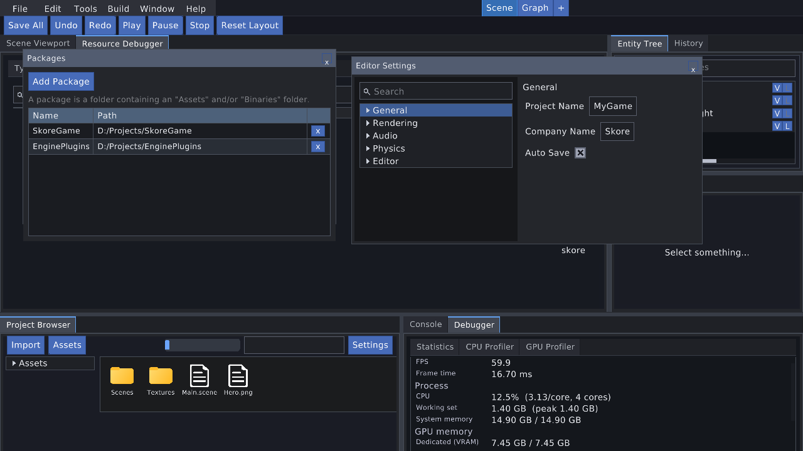

# APX-377 / APX-391 — Visual acceptance of the migrated editor

**Task:** APX-391 (re-render + re-judge after Packages / Project Browser /
Debugger / Console chrome fixes: APX-387 / APX-388 / APX-389 / APX-390)  
**Date:** 2026-08-16  
**Host:** `sk-sandbox-shell` (`sandbox/editor_shell_sandbox.c`)  
**Recipe:** lavapipe offscreen capture (`capture_create` → `paint` → `capture_frame` → `cpu_image_write_png`)  
**Viewport:** 1280×720, scale 1.0  
**Frames:** [`docs/editor/apx-377-frames/`](apx-377-frames/)  
**Rebuild:** Release `sk-sandbox-shell` (Ninja), then recapture overwrote all four PNGs.

This is the goal's final visual gate: look at the v2 editor against the C++
InitDockSpace layout and `docs/editor/migration-manifest.md`. APX-379 activates
the lowest-order tab in each leaf; APX-380 sizes Scene Viewport toolbar buttons
from their labels; APX-382 sizes Console severity labels from real glyph
advance so they no longer wrap mid-word; APX-383 labels the scene-options tool
`Scn` instead of `…`; APX-384 sizes the Entity Tree search input to the toolbar
height with 3px vertical padding so the hint is not clipped; APX-387 sizes the
Packages table from the real window width and moves the hint onto its own row;
APX-388 sizes content-grid tile captions from glyph advance so `Main.scene` is
not shaved; APX-389 hosts Debugger Statistics in a scroll view so
`Dedicated (VRAM)` is reachable; APX-390 wraps Console log lines at the panel
width. APX-391 rebuilds the host, recaptures the four frames, and re-judges.

```bash
cmake --build build --target sk-sandbox-shell
export VK_ICD_FILENAMES=/usr/share/vulkan/icd.d/lvp_icd.json
export VK_DRIVER_FILES=/usr/share/vulkan/icd.d/lvp_icd.json
(cd build/bin && ./sk-sandbox-shell --out-dir ../../docs/editor/apx-377-frames)
```

| Frame | Workspace | What it proves |
| --- | --- | --- |
| [`01_scene_workspace.png`](apx-377-frames/01_scene_workspace.png) | Scene (default) | Shell, docked Scene windows, Entity Tree hierarchy, Console log lines, Project Browser folder/file tiles, Scene placeholder, Content/Images icon strip |
| [`02_graph_workspace.png`](apx-377-frames/02_graph_workspace.png) | Graph (after switch) | Scene-only windows leave; Graph Editor takes Center |
| [`03_scene_restored.png`](apx-377-frames/03_scene_restored.png) | Scene (after switch back) | Captured Scene layout restored |
| [`04_on_demand_windows.png`](apx-377-frames/04_on_demand_windows.png) | Scene + Window menu | Packages, Settings, Resource Debugger opened; Debugger Statistics body populated |

C++ InitDockSpace zones used as the layout oracle (manifest §1 / `editor_window.h`):

| Zone | Scene (auto-open) | Graph (auto-open) |
| --- | --- | --- |
| Center | Scene Viewport | Graph Editor (scaffold, empty Draw — out of scope §4) |
| RightTop | Entity Tree, History | (none) |
| RightBottom | Properties | Properties |
| BottomLeft | Project Browser | Project Browser |
| BottomRight | Console, Debugger | Console, Debugger |
| On-demand (not auto-opened) | Packages, Settings, Resource Debugger | same |

---

## Check summary

| # | Criterion | Result |
| - | --------- | ------ |
| 1 | Shell / menu bar present | **MET** |
| 2 | All migrated windows docked and drawing | **MET** |
| 3 | Icons from Content/Images visible | **MET** |
| 4 | Scene view showing the placeholder texture | **MET** |
| 5 | Mocked panels clearly populated rather than blank | **MET** |
| 6 | Additional PNG after workspace switch proves restore | **MET** |

**Overall:** all six criteria are accepted. The migrated shell, dock map, icon
atlas, Scene placeholder, and mock window bodies read as the C++ editor.

The remaining-defects table is **empty**. The last open chrome item
(`Main.scene` clipped to `Main.scen`) is gone on the APX-391 frames (see
[Chrome-fix confirmation](#chrome-fix-confirmation-apx-382--383--384--387--388--389--390)).
A second sweep of the four 1280×720 frames found no clipped, mid-word-wrapped,
or overlapping chrome in migrated windows. Out of scope stays out of scope:
graph-node windows, real scene rendering, thumbnails.

---

## 1. Shell / menu bar — MET

**Frame:** [`01_scene_workspace.png`](apx-377-frames/01_scene_workspace.png)



**Rendered (matches `editor/editor_shell.c` menu priorities and toolbar):**

- Menu bar: File, Edit, Tools, Build, Window, Help (closed; open popups are a
  known painter's-algorithm limitation, manifest §8).
- Toolbar: Save All, Undo, Redo, Play, Pause, Stop, Reset Layout.
- Workspace switcher: Scene tab + "+" on the first frame.

---

## 2. All migrated windows docked and drawing — MET

**Frames:** [`01_scene_workspace.png`](apx-377-frames/01_scene_workspace.png),
[`02_graph_workspace.png`](apx-377-frames/02_graph_workspace.png),
[`04_on_demand_windows.png`](apx-377-frames/04_on_demand_windows.png)

Scene auto-open set is in the C++ zones. APX-379 activates the lowest-order
window of each leaf (Entity Tree, not History; Console, not Debugger).

| Window | Zone | Visible chrome |
| --- | --- | --- |
| Scene Viewport | Center | Tab + tool row + placeholder canvas |
| Entity Tree | RightTop | Selected tab; Demo Scene hierarchy |
| History | RightTop | Sibling tab |
| Properties | RightBottom | Tab + empty-selection copy |
| Project Browser | BottomLeft | Tab + Import / Assets / zoom / Settings + tiles |
| Console | BottomRight | Selected tab + toolbar + seeded log lines |
| Debugger | BottomRight | Sibling tab; Statistics body on frame 04 |

On-demand windows on frame 04 (opened via `sk_editor_shell_open_window`, the
Window-menu path):

| Window | How it appears |
| --- | --- |
| Packages | Floating `widget_window`; Add Package + Name/Path table |
| Settings | Floating `widget_window` titled Editor Settings; group tree + entries |
| Resource Debugger | Docked to Center as a tab next to Scene Viewport |

Graph after switch: Scene Viewport / Entity Tree / History leave; Graph
Editor occupies Center; Properties / Project Browser / Console / Debugger
stay. Graph Editor body is empty — expected (out of scope §2.1 / §4,
scaffold `Draw`).

Scene Viewport tool labels do not collide at 1280×720 (APX-380 / APX-383): the
row reads `Sel Move Rot Scl Glo Snap Grid Scn Play Stop 2D 3D Vol Cam Opts`.
No tool button is an ellipsis.

The Console toolbar (APX-382) keeps every severity checkbox label intact on one
line (`Trace Debug Info Warn Error Fatal`) plus Clear / Collapse / Auto-scroll
on the same row. No severity label wraps mid-word.

---

## 3. Icons from Content/Images — MET

**Frame:** [`01_scene_workspace.png`](apx-377-frames/01_scene_workspace.png)

Two consumers are on the frame:

1. **Project Browser content grid** (the in-window consumer, manifest §3.6)
   draws folder/file tiles through `sk_editor_icons_get` + atlas UVs:
   yellow `FolderIcon` tiles for Scenes / Textures, white `FileIcon` tiles
   for Main.scene / Hero.png.
2. **Sandbox icon strip** (APX-367) sits in the Scene Viewport letterbox so
   it does not cover BottomLeft / BottomRight. All five ids render:

| Id | File | Visible |
| --- | --- | --- |
| folder | `FolderIcon.png` | yellow folder |
| file | `FileIcon.png` | white document |
| logo_small | `LogoSmall.jpeg` → `logo_small.png` | red phoenix |
| logo_minimal | `minimalist-logo.png` | list + square in a circle |
| skore | `skore.ico` → `skore.png` | red phoenix |

---

## 4. Scene view placeholder texture — MET

**Frame:** [`01_scene_workspace.png`](apx-377-frames/01_scene_workspace.png)
center pane

Center is a letterboxed dark canvas with the CPU placeholder from
`sv_tex_generate` in `editor/windows/scene_view_window.c`: vertical
gradient, subtle cell grid, lighter center crosshair, grey border. Not a
solid empty panel. Real scene rendering stays out of scope (manifest §2.3).

---

## 5. Mocked panels populated rather than blank — MET

**Frames:** [`01_scene_workspace.png`](apx-377-frames/01_scene_workspace.png)
(default rest), [`04_on_demand_windows.png`](apx-377-frames/04_on_demand_windows.png)
(Debugger tab + on-demand windows)

| Panel | Expected mock | On the frames |
| --- | --- | --- |
| Entity Tree | Demo Scene / Main Camera / Directional Light / Player / Character Mesh | **Populated** on 01 — hierarchy is the selected RightTop tab (APX-379), not hidden behind History |
| Console | logger ring | **Populated** on 01 — selected BottomRight tab; seeded Info lines (`Scene workspace ready`, mock Assets/Project/Renderer) are on screen; the WARN row wraps at a word break and the rest of the message is on the next line inside the panel (APX-390) |
| Project Browser | folder tree + FolderIcon/FileIcon grid | **Populated** on 01 — Assets tree + four tiles (Scenes, Textures, Main.scene, Hero.png) using Content/Images icons; `Main.scene` is the full caption (APX-388) |
| Debugger Statistics | FPS, frame time, CPU, working set, VRAM | **Populated** on 04 — the Statistics tab shows FPS / Frame time / Process / GPU memory / Dedicated (VRAM) fully. The body is a scroll host; APX-394 sizes the inner panel to the row stack (not 100% of the leaf) and the capture scrolls only far enough for `Dedicated (VRAM)` so the previously visible stat rows stay on screen. Console is the default tab (order 10); the host activates Debugger (order 20) on the Window-menu frame so the body is not judged while hidden behind its sibling |
| History | seeded undo/redo scopes | Sibling of Entity Tree (order 10); not required on the default tab |
| Properties | empty-selection until an entity/asset is selected | **OK** — "Select something..." (not a blank dock) |

---

## 6. Workspace restore — MET

**Frames:** [`02_graph_workspace.png`](apx-377-frames/02_graph_workspace.png),
[`03_scene_restored.png`](apx-377-frames/03_scene_restored.png)





Same process: Scene → `sk_editor_shell_switch_workspace(GRAPH)` (outgoing
Scene captured) → Graph frame → switch back to Scene (saved layout
restored).

- Graph: switcher shows Scene + **Graph** (Graph selected); Center is
  **Graph Editor**; RightTop Entity Tree / History are gone; Properties /
  Project Browser / Console / Debugger remain; tiles and Console lines stay.
- Restored Scene: Center is **Scene Viewport** with the same placeholder;
  RightTop Entity Tree / History return; Properties / bottom strip return.
  The Graph workspace tab stays in the switcher (workspace still open).

That is visual proof the layout store captured Scene, swapped the live dock
model, and restored Scene.

---

## On-demand Window-menu windows — confirmed

**Frame:** [`04_on_demand_windows.png`](apx-377-frames/04_on_demand_windows.png)



Opened through `sk_editor_shell_open_window` (the same path as the Window
menu items):

- **Packages** — floating window, Add Package + hint on separate rows,
  Name/Path table of the two seeded mock folders (see
  [Chrome-fix confirmation](#chrome-fix-confirmation-apx-382--383--384--387--388--389--390)).
- **Editor Settings** — floating window, left tree (General / Rendering /
  Audio / Physics / Editor), right pane (Project Name, Company Name, Auto Save).
- **Resource Debugger** — Center tab next to Scene Viewport (Types list
  visible behind the floaters).

---

## Chrome-fix confirmation (APX-382 / 383 / 384 / 387 / 388 / 389 / 390)

Judged on the recaptured 1280×720 frames (01 / 03 for Scene chrome; Console
labels also on 02; Packages / Debugger Statistics on 04).

| Defect this wave fixed | Frame | Verdict |
| --- | --- | --- |
| Packages window hint clipped mid-quote (`"Binaries" folder.` hidden) | 04 | **Fixed (APX-392).** Add Package is on its own row; the hint is below it, wrap on, full row, 13px. Recaptured frame 04 shows the whole sentence `A package is a folder containing an "Assets" and/or "Binaries" folder.` including the closing quote and period. |
| Packages Name cells clip `SkoreGame`→`Skore`, `EnginePlugins`→`Engin` | 04 | **Fixed (APX-392).** Name/Path labels are wrap-off + flex_shrink 0 (real glyph advance); Name has no tree indent. Frame 04 shows full `SkoreGame` and `EnginePlugins` with a gap before Path. |
| Packages Path cells clip + overlap the remove `x` (leftover `s`) | 04 | **Fixed (APX-392).** Path stretch takes leftover after measured Name + reserved 36px remove; path cells clip children so they cannot paint under the button. Frame 04 shows full `D:/Projects/SkoreGame` and `D:/Projects/EnginePlugins` with a clear gap before each `x`. |
| Console severity label wraps mid-word (`Debu g`, `War n`) | 01, 02, 03 | **Fixed.** `Trace Debug Info Warn Error Fatal` are whole words on one toolbar row with Clear / Collapse / Auto-scroll. |
| Scene Viewport tool button renders as `...` | 01, 03 | **Fixed.** The Grid–Play slot is `Scn`. The full row is `Sel Move Rot Scl Glo Snap Grid Scn Play Stop 2D 3D Vol Cam Opts`. No ellipsis glyph. |
| Entity Tree search hint is clipped | 01, 03 | **Fixed.** Hint `"Search entities"` (`entity_tree_window.c:1810`) is fully inside the input, including the `g`/`y` descenders. |
| Debugger Statistics `Dedicated (VRAM)` row clipped off the leaf bottom | 04 | **Fixed (APX-394).** The statistics body is a scroll host (`debugger.content.host`); the inner `debugger.content` panel is auto-height / `flex_shrink 0` so rows are not clipped inside a 100%-of-leaf box. The capture scrolls only far enough to land `debugger.stat.vram` in the leaf, so Frame/Process stay visible and `Dedicated (VRAM)` is fully on screen (`debugger_window.c` Dedicated (VRAM) row + `dgb_apply_stats_body_style`). |
| Project Browser tile caption `Main.scene` clips to `Main.scen` | 01, 02, 03 | **Fixed (APX-393).** Caption is measured from Clay layout-font glyph advance (plus ink extent) and sized to that box with `flex_shrink 0`; the tile content width is the full thumb so a name that fits is not shaved by pad. Names wider than the tile are ellipsized (U+2026) instead of clip-shaved. Recaptured frames 01/02/03 show full `Main.scene` next to intact `Scenes` / `Textures` / `Hero.png` (seed `project_browser_window.c:269`; grid host `:1696`). |
| Console WARN line cut at the panel edge (`…mapped via Clay floati`) | 01, 02, 03 | **Fixed.** Log rows wrap at the panel width (`label_set_wrap 1` at `console_window.c:384`/`:413`); the scroll body is sized from the laid-out rows (`console_sync_scroll_size`) so Auto-scroll still lands on the newest line. The WARN row is two lines: line 1 ends on a word break before the panel edge and line 2 carries `...constraints may differ (kept best-effort mapping)` fully inside the panel. |

---

## Remaining clipped / wrapped / overlapping chrome

The previous remaining-defects table had one row (`Main.scene` → `Main.scen`).
That item is **Fixed** on the APX-391 frames (evidence in the confirmation
table above). A second sweep of all four 1280×720 frames — menu bar, shell
toolbar, workspace switcher, Scene Viewport tools, Entity Tree search / `V`
`L` toggles, Properties `Select something...`, Project Browser tiles and
toolbar, Console toolbar + wrapped WARN body, Debugger Statistics, Packages
hint + Name/Path cells, Settings tree + entries, tab titles — found no
clipped, mid-word-wrapped, or overlapping chrome in migrated windows.

| Frame | What is wrong | Source |
| --- | --- | --- |

The remaining-defects table is empty. The vision gate is closed.
