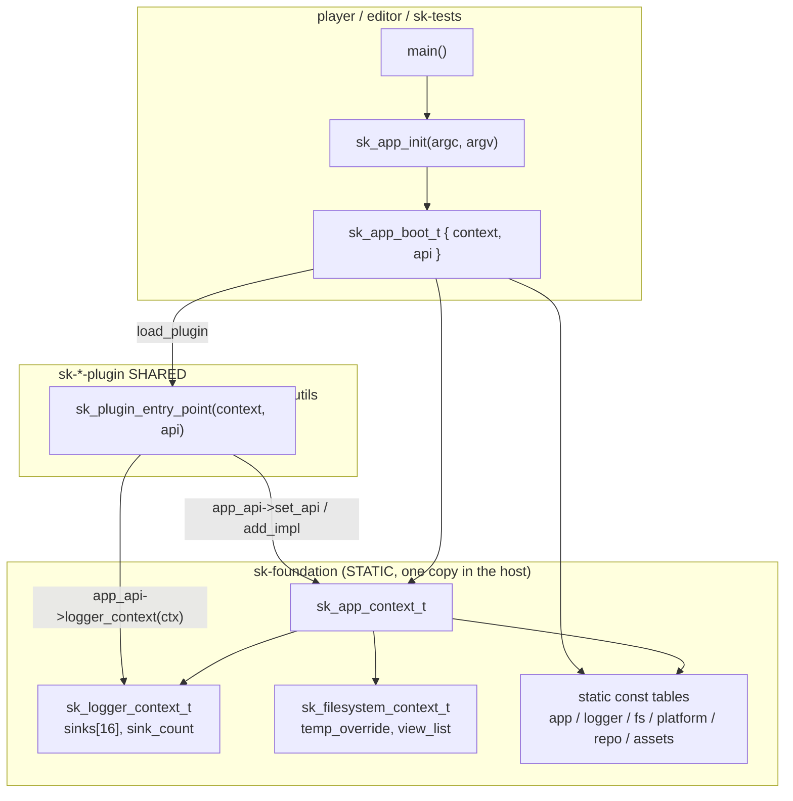
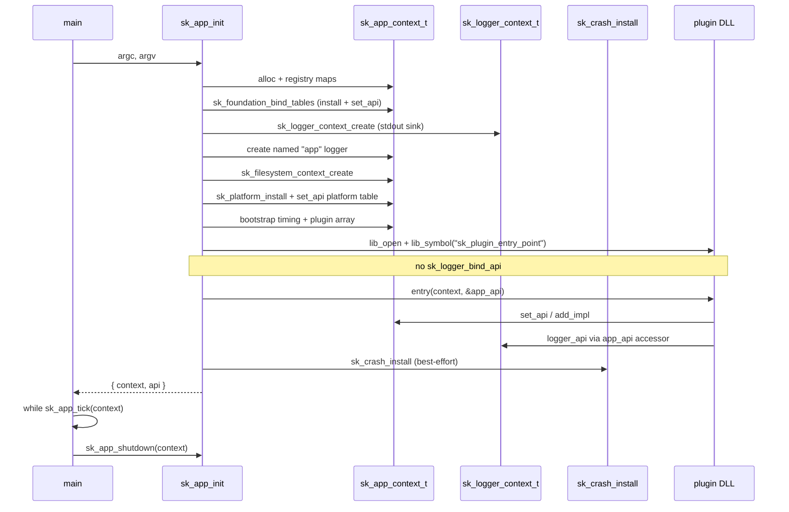

# Foundation Context & API Contract

| Field | Value |
|---|---|
| **Title** | APX-278 — Foundation context and API contract |
| **Author** | — |
| **Date** | 2026-08-12 |
| **Status** | Draft |
| **Ticket** | APX-278 |
| **Depends on** | `docs/foundation-refactor-inventory.md` (APX-277) |
| **Header sketches** | `docs/foundation/include/` |

This is a **contract-pinning** design. Implementation tasks implement this
document with **zero remaining design decisions**. Header sketches under
`docs/foundation/include/` are the public ABI implementers copy into
`foundation/` when that directory is created.

---

## Overview

`app/` and `core/` become a single **foundation** module (`sk-foundation`).
Engine state that today lives in file-scope statics — logger sinks, the
plugin-host `bound_api` bind, `builtins_repository`, filesystem
`temp_override` / `view_list` — moves onto an explicit `sk_app_context_t`
(and the logger / filesystem contexts it owns). Process-wide
`sk_*_api(void)` accessors are deleted. Hosts receive both the context and
the immutable `sk_app_api_t` table from `sk_app_init` as `sk_app_boot_t`.
Plugins already take `(context, app_api)` at entry; they stop calling
`sk_logger_api()` / `sk_logger_bind_api` and use `app_api->logger_context`
/ `app_api->logger_api` instead.

The goal is one shared state object per boot, visible to the host **and**
every statically-linked plugin copy of the engine, without per-DLL mutable
module state that breaks tests and splits sinks.

---

## Background & Motivation

### Current state

- **Split libraries.** `sk-core` (STATIC, PIC) holds engine utilities and
  *declares* `sk_app_*`. `sk-app` (STATIC) *implements* process lifecycle
  (`app/app.c`) and OS backends (`platform_*.c`, `filesystem_*.c`). Plugins
  link `sk-core` only (AGENTS.md) and therefore each carry a private copy of
  `logger.c` statics.
- **Process-wide accessors.** Six `sk_*_api(void)` functions
  (inventory §2): `sk_app_api`, `sk_logger_api`, `sk_filesystem_api`,
  `sk_platform_api`, `sk_repository_api`, `sk_resource_assets_api`. ~500
  call sites.
- **Host-bind hack.** `app/app.c:554-563` `dlsym`s `sk_logger_bind_api` in
  every plugin and writes the plugin's `bound_api` static. CMake
  (`cmake/cmake_functions.cmake:174-183`) force-exports that symbol.
- **Known offenders** (inventory §1.1) in `core/logger.c:17-22` and
  `core/resource_asset_builtins.c:28`.
- **Test-only cycle.** `sk-core-tests` TUs call `sk_app_create` /
  `sk_app_api` (`resource_assets.c` / `resource_asset_builtins.c` SK_TESTS
  regions). Production core does not call app symbols.

### Pain points

1. Plugin logs miss host sinks unless bind succeeds; bind is a hidden
   per-DLL static.
2. Automated tests cannot isolate logger/fs state; sinks leak across cases.
3. `view_list` is never torn down (inventory §1.2) — mmap leak on shutdown.
4. `sk_app_init` returns only a context; callers immediately call
   `sk_app_api()` for the table (player `main.c:1180-1198`).
5. AGENTS.md's "core declares / app implements" split is the reason plugins
   have a private engine copy of logger state in the first place.

---

## Goals & Non-Goals

### Goals

- Merge `core/` + `app/` into `foundation/` (`sk-foundation` STATIC, PIC ON).
- **No mutable file-scope or function-scope statics for engine state** in
  foundation. (`static const` tables stay; OS-mandated crash/DbgHelp and TLS
  `platform_err` are the documented exceptions — see inventory decisions.)
- Kill the five §1.1 offenders.
- `sk_app_init` returns `{context, api}`. Single teardown: `sk_app_shutdown`.
- `sk_logger_context_t` owns sinks; `sk_app_api_t` exposes it.
- Remove every `sk_*_api(void)` accessor listed in inventory §2, plus
  `sk_logger_bind_api` / `sk_logger_get_api` / `sk_*_get_api`.
- Plugin entry stays `(context, app_api)` and is the only way plugins see
  host state.
- Pin every inventory §6 open question.

### Non-Goals

- Per-context mimalloc heaps (`mi_heap_new`) — stay on the process default
  (`sk_allocator_default`).
- Making Unity / `SK_TEST` constructor registration context-owned (§6.7).
- Changing plugin SHARED + static-link-engine policy (they will link
  `sk-foundation` instead of `sk-core`; they still do not call `sk_app_init`).
- Rewriting plugin-internal file-scope caches of the host pointers they were
  handed at entry (e.g. `profiler.c` `app_context` / `app_api_table`). Those
  are plugin instance state, not foundation engine state.
- ECS, render, editor object model, compression codec work.
- Vendoring new third-party libraries.

---

## Key Decisions

1. **`sk_app_context_t` stays opaque** in `foundation/app.h`. The single
   struct definition lives in `foundation/internal/app_context.h` and is
   included only by foundation `.c` files. Rationale: AGENTS.md opaque-by-
   default; plugins must not depend on layout.

2. **`sk_app_init` / `startup` / `create` return `sk_app_boot_t`.** Both
   fields non-NULL on success; both NULL on failure (`sk_app_boot_failed()`).
   Rationale: one value, no out-param ambiguity, matches "return both".

3. **Single teardown name: `sk_app_shutdown`.** `sk_app_destroy` is deleted
   (not aliased). Applies to create/startup/init contexts. Rationale: one
   name everywhere; "destroy" hid crash uninstall + plugin unload.

4. **`sk_app_create` / `sk_app_startup` / `sk_app_tick` / `sk_app_run` stay.**
   create = registry only; startup = platform + logger + fs, no plugins, no
   crash; init = startup + plugin scan + crash install; tick/run unchanged
   as host-only free functions (not duplicated on the table).

5. **`sk_app_api_t` keeps today's registry/plugin/timing entries and adds
   accessors** for logger context, logger API, app logger, filesystem
   context, filesystem API, platform API, repository API, resource-assets
   API. Full table is in `docs/foundation/include/app.h`.

6. **Logger choice (a): one logger context per app context, passed
   everywhere. `bound_api` and bind are deleted.** Plugins never have a
   private sink list. Rationale: bind exists only because of per-DLL
   statics; removing the statics removes the need.

7. **Logger table functions take `sk_logger_context_t*` first.** Helpers
   (`sk_log_*`) stay `(api, logger, fmt, …)` and use
   `sk_logger_get_context(logger)` (named loggers store a back-pointer set
   at create). No `module_ready`; create installs the stdout sink.

8. **`builtins_repository` becomes a field on `sk_resource_assets_context_t`,
   set in `create`.** `sk_resource_asset_builtins_bind_repository` is
   deleted. Handler create/load/save/reloaded/after_move and ingest/cook
   contexts gain `repository` + `repo_api`.

9. **All six `sk_*_api(void)` accessors are removed in this same contract**,
   including filesystem, platform, repository, and resource-assets.
   Immutable tables remain `static const` in their TUs. Addresses are
   cached via foundation-internal `sk_*_install` hooks (see Table obtain
   path). Not public, not `SK_API`, not `extern` table objects.

10. **Standalone serialize / type-register APIs take the table as a
    parameter.** Every `sk_resource_serialize_*` / `sk_resource_deserialize_*`
    gains `const sk_repository_api_t* repo_api` immediately after
    `repository`. `sk_resource_assets_register_types` does the same. The
    two file I/O helpers also take `const sk_filesystem_api_t* fs`. No
    process-getter fallback.

11. **Logger context + `sk_app_boot_t` accessors land in one PR.** There is
    no interim `sk_logger_api()` and no `get_api` bridge. One ABI flip.

12. **Foundation directory is `foundation/`**, public headers
    `foundation/*.h` (no `sk_` file prefix), internal headers
    `foundation/internal/*.h`. CMake target **`sk-foundation`**. Include
    style stays `#include "app.h"` (PUBLIC include dir = `foundation/`).

13. **Plugins continue to statically link the engine lib** (`sk-foundation`).
    They still must not call `sk_app_init`. After the merge there is no
    `sk-app` to "not link".

14. **Crash / DbgHelp stay process-owned** (OS constraint). First successful
    `sk_app_init` that installs sets `context->crash_owned`; matching
    `sk_app_shutdown` calls `sk_crash_uninstall`. Existing refcount in
    `crash.c` remains. DbgHelp: one process session, existing critical
    section. Multiple contexts allowed for tests; they share crash/DbgHelp.

15. **TLS `platform_err` stays TLS.** QPC frequency stays a write-once
    process invariant (not context state). CRT stdout/stderr/time/fopen
    stay CRT; file sinks own their FILE* and are allocated with an
    explicit `sk_allocator_t*` passed to `sk_log_file_sink_create`.

16. **`SK_TEST` / Unity stay process-global per binary.** Out of this
    refactor.

17. **Test-only core→app link edge dies with the merge** (one
    `sk-foundation-tests` lib). Assets tests that call `sk_app_*` stay in
    those TUs.

---

## Proposed Design

### Module layout

```
foundation/
├── CMakeLists.txt              # sk-foundation, sk-foundation-lib, sk-test, sk-foundation-tests
├── internal/
│   ├── app_context.h           # struct sk_app_context_t
│   ├── logger_context.h        # struct sk_logger_context_t
│   └── filesystem_context.h    # struct sk_filesystem_context_t
├── app.h / app.c               # was core/app.h + app/app.c
├── logger.h / logger.c
├── platform.h / platform_unix.c / platform_win32.c
├── filesystem.h / filesystem.c / filesystem_unix.c / filesystem_win32.c
├── repository.h / repository.c
├── resource_assets.h / resource_assets.c
├── resource_asset_builtins.h / .c
├── crash.h / crash.c
├── stacktrace.h / stacktrace.c
├── plugin.h                    # entry typedef + export (new public header)
├── test.h / test.c             # test.c still excluded from production lib
└── …                           # remaining former core/* modules
```

`app/` and `core/` directories are removed after the move. Root
`CMakeLists.txt` replaces `add_subdirectory(core)` + `add_subdirectory(app)`
with `add_subdirectory(foundation)` (same position, before editor/player).

**Include path:** `#include "app.h"`, `#include "logger.h"`, … — **not**
`#include <foundation/app.h>`. This avoids rewriting every first-party
include.

**CMake targets**

| Target | Kind | Role |
|---|---|---|
| `sk-foundation` | STATIC, PIC ON | Production engine + host lifecycle + OS backends |
| `sk-foundation-lib` | INTERFACE | Headers only (optional) |
| `sk-test` | STATIC | Test registry (`test.c` + Unity); unchanged role |
| `sk-foundation-tests` | STATIC | Same sources with `SK_TESTS` |
| `sk-core` / `sk-app` / `sk-core-tests` / `sk-app-tests` | — | **Deleted** after a single transition PR that can ship INTERFACE aliases pointing at `sk-foundation` / `sk-foundation-tests` so downstream CMake edits land in the same change |

`sk_add_plugin`: `target_link_libraries(... PRIVATE sk-foundation)`.
**Remove** the `sk_logger_bind_api` force-export block
(`cmake/cmake_functions.cmake:174-183`).

Player / editor: `target_link_libraries(... PRIVATE sk-foundation)`
(or keep linking a thin host target that is just an alias).

`sk-tests`: whole-archive `sk-foundation-tests` (one lib, no
core/app split).

`sk-crash-trigger` / compression conformance / benches: link
`sk-foundation` instead of `sk-core`.

Platform backend selection stays as in `app/CMakeLists.txt` (compile only
unix or win32 filesystem/platform TUs).

**CMake is the union of `core/CMakeLists.txt` + `app/CMakeLists.txt`:**

- Production `sk-foundation`: PRIVATE mimalloc, yyjson, zstd/lz4/miniz
  (same `SK_COMPRESSION_HAS_*` gates); PUBLIC Threads, `m`, `dl`,
  dbghelp (Win32), `CMAKE_DL_LIBS`, `shell32` (Win32).
- PRIVATE plugin header dirs on **`sk-foundation-tests` only** (same list
  as today's `sk-app-tests`: `platform_window`, `entities`, `dxc_compiler`,
  `render_graph`, `render_device`, `profiler`) because `app.c` SK_TESTS
  includes those headers.
- Production `sk-foundation` may keep the profiler/render_device PRIVATE
  includes `app/CMakeLists.txt` already has for host wiring.
- PIC ON. `test.c` excluded from production; `sk-test` unchanged.

**PR 1 required checklist (configure-time):**

- Replace `core/` + `app/` with `foundation/` in
  `sk_embed_type_ids_in_dir(...)` (`CMakeLists.txt:28-35`).
- Same replacement in `sk_check_header_isolation(...)` (`CMakeLists.txt:39-46`).
- New type ids are **pre-hashed** in the public headers (not `SK_TYPE_ID_ZERO`):
  - `SK_REPOSITORY_API_TYPE_ID` = MD5(`sk.repository_api`)
    `0x529d5721e95fa579ULL`, `0x5d7928cd14815381ULL`
  - `SK_FILESYSTEM_API_TYPE_ID` = MD5(`sk.filesystem_api`)
    `0xb8556b0d8f2c7ef6ULL`, `0x53aa55a880068ac1ULL`
  - `SK_RESOURCE_ASSETS_API_TYPE_ID` = MD5(`sk.resource_assets_api`)
    `0xcceb767bc7a323b7ULL`, `0x2d273f5d983e8243ULL`

### Table obtain path (foundation-internal install hooks)

This is the **only** way `app.c` gets addresses of `static const` tables
after `sk_*_api()` is deleted. It is **not** a public accessor and **not**
an `extern` of the table object.

Declared in `foundation/internal/tables.h` (sketch:
`docs/foundation/include/internal/tables.h`). No `SK_API`. Not in any
public header. Plugins and hosts must not call these.

| Function | Defined in | Writes |
|---|---|---|
| `sk_logger_install` | `logger.c` | `ctx->logger_api = &logger_api` |
| `sk_filesystem_install` | `filesystem_unix.c` / `filesystem_win32.c` (same TU as that backend's `static const` table) | `ctx->filesystem_api = &filesystem_api` |
| `sk_repository_install` | `repository.c` | `ctx->repository_api = &repository_api` |
| `sk_resource_assets_install` | `resource_assets.c` | `ctx->resource_assets_api = &resource_assets_api` |
| `sk_platform_install` | `platform_unix.c` / `platform_win32.c` | `ctx->platform = &platform_api` |
| `sk_foundation_bind_tables` | `app.c` | calls the four non-platform installs, then `set_api` for each |

Each `sk_*_install` includes `foundation/internal/app_context.h` and
**assigns the context field only**. Install functions never call
`set_api` and never need the app table.

`sk_foundation_bind_tables` is the **only** `set_api` caller for logger /
filesystem / repository / resource-assets. `sk_app_startup` is the **only**
`set_api` caller for platform (after `sk_platform_install`). There is no
`sk_app_registry_set` helper and no per-install `set_api`.

```c
void sk_logger_install(sk_app_context_t* ctx)
{
	ctx->logger_api = &logger_api;
}

void sk_foundation_bind_tables(sk_app_context_t* ctx)
{
	sk_logger_install(ctx);
	sk_filesystem_install(ctx);
	sk_repository_install(ctx);
	sk_resource_assets_install(ctx);
	app_api.set_api(ctx, SK_LOGGER_API_TYPE_ID, ctx->logger_api);
	app_api.set_api(ctx, SK_FILESYSTEM_API_TYPE_ID, ctx->filesystem_api);
	app_api.set_api(ctx, SK_REPOSITORY_API_TYPE_ID, ctx->repository_api);
	app_api.set_api(ctx, SK_RESOURCE_ASSETS_API_TYPE_ID, ctx->resource_assets_api);
}
```

`sk_app_create` sequence: alloc → init maps → `sk_foundation_bind_tables`
→ return `{ctx, &app_api}`.

`sk_app_startup` additionally: `sk_platform_install(ctx)` then
`app_api.set_api(ctx, SK_PLATFORM_API_TYPE_ID, ctx->platform)`, then
create logger context + named `"app"` logger + filesystem context.

Forbidden: public `sk_*_api()`, `extern const sk_logger_api_t logger_api`,
plugin-visible install symbols.

### Architecture



### Boot sequence



### `sk_app_context_t` — ownership, allocation, teardown

**Public:** opaque (`typedef struct sk_app_context_t sk_app_context_t`).

**Internal** (`foundation/internal/app_context.h`) — this is the one
definition all foundation TUs include:

```c
struct sk_app_context_t {
	sk_app_api_map_t apis;
	sk_app_impl_map_t impls;

	const sk_allocator_t* allocator;

	/* Cached immutable tables (set at create; always non-NULL after success). */
	const sk_logger_api_t* logger_api;
	const sk_filesystem_api_t* filesystem_api;
	const sk_repository_api_t* repository_api;
	const sk_resource_assets_api_t* resource_assets_api;

	/* Created by startup/init; NULL after sk_app_create. */
	sk_logger_context_t* logger_ctx;
	sk_logger_t* log;
	sk_filesystem_context_t* fs_ctx;
	const sk_platform_api_t* platform;

	i32 initialized;          /* 1 after successful bootstrap_init */
	i32 shutdown_requested;
	i32 loop_started;
	i32 crash_owned;          /* 1 if this context called sk_crash_install */
	i32 argc;                 /* borrowed from sk_app_init; grouped with flags */
	u8 _pad0[4];              /* pointer-align argv (LP64 / LLP64) */
	char** argv;              /* borrowed; unused by bootstrap besides storage */
	f64 start_seconds;
	f64 last_frame_seconds;
	f64 delta_time;
	f64 fps;
	f64 elapsed_time;
	plugin_lib_array_t plugins;
	const sk_profiler_api_t* profiler_api;
};
```

`argc` is stored as `i32` with the other flags; `u8 _pad0[4]` makes
`argv` pointer-aligned. No silent padding.

**Allocation.** `sk_app_create` allocates the struct with
`sk_allocator_default()`, inits the two hash maps, calls
`sk_foundation_bind_tables(ctx)` (install hooks write cached table
pointers; bind_tables registers type ids so `get_api` works), leaves
logger/fs *contexts*, platform, and runtime zeroed. `boot.api` is
`&app_api`.

**Ownership.** Caller of create/startup/init owns the context until
`sk_app_shutdown`. The context owns: maps, logger context, named "app"
logger, filesystem context, plugin `sk_shared_lib_t` handles (closed on
shutdown). It does **not** own: `argv` strings, plugin-registered API
tables (those live in plugin DSO data), FILE*s created by callers, crash
OS handlers (process-owned; this context only holds a refcount token).

**Teardown (`sk_app_shutdown`) order:**

1. If `crash_owned`: `sk_crash_uninstall()`; `crash_owned = 0`.
2. Profiler shutdown (cached table) — before DSOs unload.
3. `lib_close` every plugin; free plugin array.
4. Destroy named `log` via `logger_api->destroy_logger`.
5. `sk_logger_context_destroy(logger_ctx)` — does not close FILE*s.
6. `sk_filesystem_context_destroy(fs_ctx)` — unmaps leftover views.
7. Free impl lists, impl map, api map.
8. `allocator->free` the context.

**Thread-safety.** Main thread only. No worker-safe context methods.
Exceptions (documented, not on the context):

- `sk_platform_api_t::lib_error` — TLS buffer; safe to read on the calling
  thread after a fail on that thread.
- `sk_platform_api_t::monotonic_seconds` — OS clock; worker-safe.
- Crash handler — async-signal / VEH; uses only `crash.c` process state.

**Multiple contexts.** Allowed. Tests may hold several registry-only
contexts, or sequentially boot full contexts. Two live `sk_app_init`
contexts: each has its own logger sinks (duplicate stdout if both log);
crash install is refcounted; DbgHelp is shared. Player/editor create
exactly one.

### `sk_app_api_t` — full table

See `docs/foundation/include/app.h` for the complete documented struct.
Field order is ABI; implementers fill a `static const sk_app_api_t` in
`app.c` exactly in this order:

| Field | First arg | State |
|---|---|---|
| `set_api` | `context` | registry |
| `get_api` | `context` | registry |
| `add_impl` | `context` | registry |
| `remove_impl` | `context` | registry |
| `impl_count` | `context` | registry |
| `get_all_impls` | `context` | registry |
| `load_plugin` | `context` | requires `initialized` |
| `request_shutdown` | `context` | flag |
| `delta_time` | `context` | timing |
| `fps` | `context` | timing |
| `elapsed_time` | `context` | timing |
| `logger_context` | `context` | may be NULL |
| `logger_api` | `context` | always non-NULL after create |
| `app_logger` | `context` | may be NULL |
| `filesystem_context` | `context` | may be NULL |
| `filesystem_api` | `context` | always non-NULL after create |
| `platform_api` | `context` | NULL on registry-only |
| `repository_api` | `context` | always non-NULL after create |
| `resource_assets_api` | `context` | always non-NULL after create |

Accessor implementations are trivial field reads (no `get_api` hash lookup
on the hot path). `set_api` still registers the same pointers under type
ids for plugins that already use `get_api(ctx, SK_LOGGER_API_TYPE_ID)`.

`load_plugin` **must not** look up `sk_logger_bind_api`. It opens the DSO,
resolves `sk_plugin_entry_point`, calls `entry(context, &app_api)`, pushes
the handle. Failure closes the handle and returns non-zero.

### `sk_app_init` / shutdown — exact signatures

```c
typedef struct sk_app_boot_t {
	sk_app_context_t* context;
	const sk_app_api_t* api;
} sk_app_boot_t;

/* C++-safe: no compound-literal macro. */
SK_FINLINE sk_app_boot_t sk_app_boot_failed(void);

sk_app_boot_t sk_app_create(void);
sk_app_boot_t sk_app_startup(void);
sk_app_boot_t sk_app_init(int argc, char* argv[]);
void sk_app_shutdown(sk_app_context_t* context);
i32 sk_app_tick(sk_app_context_t* context);
i32 sk_app_run(sk_app_context_t* context);
```

**Error handling.** Recoverable failure (OOM, map init fail, logger create
fail) → `sk_app_boot_failed()` and no leaked context (destroy whatever was
partially built before returning). Crash install failure during init is
**not** a boot failure (same as today `app/app.c:649-651`); log a warning
on the app logger and leave `crash_owned = 0`. `sk_app_run` returns `-1` if
`initialized == 0`, else `0` after the loop. Programmer misuse (NULL
context on tick/shutdown/table calls) is a debug assert, not a production
`-1` (AGENTS.md).

**Host call shape:**

```c
int main(int argc, char* argv[])
{
	sk_app_boot_t boot = sk_app_init(argc, argv);
	if (boot.context == NULL) {
		return 1;
	}
	const sk_app_api_t* app_api = boot.api;
	sk_app_context_t* ctx = boot.context;
	/* ... */
	while (sk_app_tick(ctx)) { }
	sk_app_shutdown(ctx);
	return 0;
}
```

### `sk_logger_context_t`

**Public:** opaque.

**Internal** (`foundation/internal/logger_context.h`):

```c
struct sk_logger_context_t {
	sk_log_sink_t sinks[SK_LOGGER_MAX_SINKS]; /* 16 */
	u32 sink_count;
	const sk_allocator_t* allocator;
};

struct sk_logger_t {
	char name[SK_LOGGER_NAME_MAX]; /* 64 */
	sk_logger_context_t* context;
};
```

No `module_ready`. No `bound_api`.

**Create:** allocate, zero, `sinks[0] = *sk_logger_stdout_sink()`,
`sink_count = 1`. **Destroy:** free the struct only.

**FILE* ownership.** The context never `fclose`s. The stdout sink writes
`stdout` (CRT singleton; not owned). `sk_log_file_sink_t` owns its `FILE*`;
caller `remove_sink` then `sk_log_file_sink_destroy`. A plugin must not
destroy a host sink. Shutdown unloads plugins *before* destroying the
logger context, so host sinks outlive plugin code.

**Plugin-created named loggers** are the plugin's to destroy; leaking them
across unload is accepted (no plugin unload hook exists). The vulkan
helper (`vulkan_render_device.c:41-82`) must stop calling `sk_logger_api()`:
cache `(context, app_api)` at entry (already has `plugin_context` /
`plugin_app_api`), obtain `logger_api` / `log_ctx` from those accessors,
and `destroy_logger` every logger it `create_logger`s (today it already
destroys the per-message logger; after the arity change it must pass
`log_ctx` into create/destroy). Prefer caching one named `"Skore::Vulkan"`
logger for the plugin lifetime instead of allocate-per-message.

**Plugin bind without a static.** There is no bind. At entry the plugin
does:

```c
const sk_logger_api_t* logger_api = app_api->logger_api(context);
sk_logger_context_t* log_ctx = app_api->logger_context(context);
sk_logger_t* log = logger_api->create_logger(log_ctx, "vulkan");
```

If a plugin TU today wraps `sk_logger_api()` in a helper
(`vulkan_logger_api` in `vulkan_render_device.c:41`), that helper becomes a
function that takes the api pointer received at init, or the plugin stores
the host `app_api`/`context` it was given (plugin instance state).

**`sk_logger_api_t` table** (immutable, `static const` in `logger.c`):

```c
sk_logger_t* (*create_logger)(sk_logger_context_t* log_ctx, const_chr_t name);
void (*destroy_logger)(sk_logger_context_t* log_ctx, sk_logger_t* logger);
void (*message)(sk_logger_context_t* log_ctx, sk_logger_type_t type, sk_logger_t* logger, const_chr_t message);
i32 (*add_sink)(sk_logger_context_t* log_ctx, const sk_log_sink_t* sink);
i32 (*remove_sink)(sk_logger_context_t* log_ctx, const sk_log_sink_t* sink);
```

`add_sink` returns `-1` when `sink_count >= SK_LOGGER_MAX_SINKS`.

Deleted symbols: `sk_logger_api`, `sk_logger_bind_api`, `sk_logger_get_api`.

Kept free functions: `sk_logger_context_create` / `_destroy` /
`_allocator`, `sk_logger_get_context`, `sk_logger_stdout_sink`,
`sk_log_file_sink_*`, `sk_logger_type_name`, `sk_logger_name`, `sk_log_*`.

### Repository + builtins

`sk_repository_t` is already instance-owned (`core/repository.h:17-20`).
Only the table pointer was global (`repository.c:3091` +
`sk_repository_api` at `repository.h:818`).

**Removal plan for `sk_repository_api()`:**

1. Keep `static const sk_repository_api_t repository_api` in
   `repository.c` (immutable — allowed).
2. `sk_repository_install` writes `ctx->repository_api = &repository_api`;
   `sk_foundation_bind_tables` `set_api`s the type id. No public getter.
3. Delete `sk_repository_api()` from the header and `.c`.
4. Replace every call site (`inventory §2.1`: **187** hits) with a table
   pointer the caller already has (`app_api->repository_api(ctx)`,
   `assets_ctx->repo_api`, or the new `repo_api` parameter on serialize /
   `register_types`).

**Inside `repository.c`:** implementation functions already take
`sk_repository_t*`. The table wrappers do not need the app context. TUs
that today write `const sk_repository_api_t* repo = sk_repository_api();`
take the table from `app_api`, `assets_ctx->repo_api`, or a
`repo_api` parameter (serialize / `register_types`).

**`builtins_repository`:** field on `sk_resource_assets_context_t`
(internal):

```c
sk_repository_t* repository;                 /* set in create(); borrowed */
const sk_repository_api_t* repo_api;         /* set in create() */
sk_app_context_t* app_context;
const sk_app_api_t* app_api;
```

`sk_resource_assets_api_t::create` (already
`(repository, app_context, app_api, allocator)` at
`resource_assets.h:224`) assigns those fields. No bind function.

Handler / ingest / cook signatures change as specified in
`docs/foundation/include/resource_assets.h`. Builtins helpers
(`builtins_create` etc. in `resource_asset_builtins.c:34-68`) take
`repository` + `repo_api` parameters instead of the static.

`sk_resource_asset_builtins_register_types` and
`sk_resource_assets_register_types` both gain
`const sk_repository_api_t* repo_api`.

`sk_resource_assets_api()` is deleted the same way as the repository
accessor (`sk_resource_assets_install`).

### Serialize / deserialize signatures

Public functions in `resource_serialize.h` today take only
`sk_repository_t*` and internally call `sk_repository_api()`. After this
contract they take the table explicitly. Exact signatures are in
`docs/foundation/include/resource_serialize.h`. Pattern:

```c
i32 sk_resource_serialize_json(sk_repository_t* repository, const sk_repository_api_t* repo_api,
                               sk_rid_t rid, sk_archive_writer_t* writer);
i32 sk_resource_assets_register_types(sk_repository_t* repository, const sk_repository_api_t* repo_api);
```

File helpers (`sk_resource_serialize_package_json_to_file` /
`sk_resource_deserialize_package_json_from_file`) also take
`const sk_filesystem_api_t* fs` and use only stateless entries
(`open_file` / `read_file` / `write_file` / `close_file` /
`get_file_size`). They do not take a filesystem context.

Callers already have the tables: `app_api->repository_api(ctx)`,
`app_api->filesystem_api(ctx)`, or `assets_ctx->repo_api`. Tests that
construct a repository without an app context take
`boot.api->repository_api(boot.context)` after `sk_app_create`.

### Plugin entry

**Signature is unchanged** (ABI-stable with every plugin in tree):

```c
typedef int (*sk_plugin_entry_point_fn)(sk_app_context_t* context, const sk_app_api_t* app_api);

SK_API int sk_plugin_entry_point(sk_app_context_t* context, const sk_app_api_t* app_api);
```

Public header: `foundation/plugin.h` (sketch:
`docs/foundation/include/plugin.h`). Host `load_plugin` uses this typedef
(today it is file-local in `app/app.c:21`).

This already shares host state **if** plugins stop using private
`sk_*_api()`. That is mandatory. `sk_plugin_run_tests` is unchanged
(`#ifdef SK_TESTS` only).

### Filesystem context

**Internal** (`foundation/internal/filesystem_context.h`; sketch under
`docs/foundation/include/internal/filesystem_context.h`):

```c
typedef struct sk_fs_view_entry_t {
	void* addr;
	size_t size;
	struct sk_fs_view_entry_t* next;
} sk_fs_view_entry_t;

struct sk_filesystem_context_t {
	char temp_override[SK_FS_PATH_MAX]; /* SK_FS_TEMP_CAP == SK_FS_PATH_MAX */
	i32 temp_override_set;
	u8 _pad0[4];
	sk_fs_view_entry_t* view_list;
	const sk_allocator_t* allocator;
};
```

**Shared TU:** new `foundation/filesystem.c` implements **only**
`sk_filesystem_context_create` / `_destroy`. It does **not** implement
`sk_filesystem_install` (it cannot see the backend `static const` table).

**Install:** `sk_filesystem_install` lives in each backend TU
(`filesystem_unix.c` / `filesystem_win32.c`) next to that TU's
`static const sk_filesystem_api_t`. Same pattern as `sk_platform_install`.
PR 2 may call it after the module move (those backend TUs already exist);
PR 3 adds `filesystem.c` for create/destroy only.

Backends also implement table operations plus
`sk_filesystem_backend_unmap(addr, size)`.

**Destroy:** if `fs == NULL`, no-op. Else walk `view_list`: for each node,
`sk_filesystem_backend_unmap(node->addr, node->size)`,
`allocator->free(node)`, then `allocator->free(fs)`. This fixes the
current shutdown leak. View nodes are allocated with `fs->allocator`
(not raw `malloc`).

**Table deltas** (only these four change):

```c
void (*setup_temp_folder)(sk_filesystem_context_t* fs, const_chr_t temp_folder);
i32 (*temp_folder)(sk_filesystem_context_t* fs, char_ptr_t out, u32 out_cap);
void_ptr_t (*map_view_of_file)(sk_filesystem_context_t* fs, sk_file_handle_t mapping);
i32 (*unmap_view_of_file)(sk_filesystem_context_t* fs, void_ptr_t map);
```

Stateless entries stay as they are (OS cwd, open/read/write, directory
iteration). Process cwd is a CRT/OS singleton (§6.6); we do not pretend
to own it.

`sk_filesystem_api()` / `sk_filesystem_get_api()` deleted.

### Platform

Table layout **unchanged** (`core/platform.h:42-83`). Accessor
`sk_platform_api()` / `sk_platform_get_api()` deleted. Hosts use
`app_api->platform_api(ctx)` (NULL on registry-only create).
**`sk_platform_init` is deleted.** The only internal hook is
`sk_platform_install` (startup calls it, then `set_api` in `app.c`).

`lib_error` keeps the 512-byte TLS buffer (`SK_PLATFORM_ERR_CAP`).
Win32 `monotonic_seconds` keeps a function-scope write-once
`LARGE_INTEGER freq` — classified as a **process hardware invariant**,
not engine state (see §6.5).

### Const / immutable statics (inventory §1.6)

**Allowed to remain `static const` / write-once const tables:**

- All codec tables, type descriptors, crash signal lists, stacktrace
  backend pointers, `stdout_sink`, every `static const sk_*_api_t` table
  (the table *objects*), builtin handler/importer tables that are never
  mutated after registration.

Builtin handler tables that are declared non-const but never mutated
(`resource_asset_builtins.c` 18 handlers + 6 importers) **stay file-static
as `static const` where the type allows**, or remain non-const static
**only if** they are never written after init. They are not "engine
state" in the §1.1 sense (no per-DLL sink list). Do not put mutable
`user_data` on those shared tables to smuggle a context — that would
re-break multi-context tests.

### What happens to each inventory class

| Class | Decision |
|---|---|
| §1.1 five offenders | Deleted; state on logger / assets context |
| §1.2 fs statics | Moved onto `sk_filesystem_context_t` |
| §1.3 crash/stacktrace | Stay process-owned in those TUs (exception) |
| §1.3 test.c registry | Out of scope (§6.7) |
| §1.3 [T] counters / fixtures | Stay in `#ifdef SK_TESTS` for this refactor |
| §1.4 [T] function-scope statics in app.c tests | Stay [T] |
| §1.4 QPC `freq` | Stay write-once process invariant |
| §1.5 TLS `platform_err` | Stay TLS |
| §1.6 const tables | Stay `static const` |
| §1.7 static functions | Not state; ignore |

---

## API / Interface Changes

### Deleted

```c
const sk_app_api_t* sk_app_api(void);
void sk_app_destroy(sk_app_context_t* context);

const sk_logger_api_t* sk_logger_api(void);
SK_API void sk_logger_bind_api(const sk_logger_api_t* api);
void sk_logger_get_api(sk_logger_api_t* out);

void sk_filesystem_get_api(sk_filesystem_api_t* out);
const sk_filesystem_api_t* sk_filesystem_api(void);

void sk_platform_get_api(sk_platform_api_t* out);
const sk_platform_api_t* sk_platform_api(void);

SK_API const sk_repository_api_t* sk_repository_api(void);
SK_API const sk_resource_assets_api_t* sk_resource_assets_api(void);

void sk_resource_asset_builtins_bind_repository(sk_repository_t* repository);
```

### Changed

```c
/* before */ sk_app_context_t* sk_app_init(int argc, char* argv[]);
/* after  */ sk_app_boot_t     sk_app_init(int argc, char* argv[]);
/* same change for sk_app_create / sk_app_startup */

/* logger table: every entry gains sk_logger_context_t* first */

sk_log_file_sink_t* sk_log_file_sink_create(const_chr_t path, u64 max_bytes, u32 max_files,
                                            const sk_allocator_t* allocator);

i32 sk_resource_asset_builtins_register_types(sk_repository_t* repository,
                                              const sk_repository_api_t* repo_api);
i32 sk_resource_assets_register_types(sk_repository_t* repository,
                                      const sk_repository_api_t* repo_api);

i32 sk_resource_serialize_json(sk_repository_t* repository, const sk_repository_api_t* repo_api,
                               sk_rid_t rid, sk_archive_writer_t* writer);
i32 sk_resource_deserialize_json(sk_repository_t* repository, const sk_repository_api_t* repo_api,
                                 sk_archive_reader_t* reader, sk_rid_t* out_rid);
i32 sk_resource_serialize_package_json(sk_repository_t* repository, const sk_repository_api_t* repo_api,
                                       sk_rid_t root_rid, sk_archive_writer_t* writer);
i32 sk_resource_deserialize_package_json(sk_repository_t* repository, const sk_repository_api_t* repo_api,
                                         sk_archive_reader_t* reader, sk_rid_t* out_root);
i32 sk_resource_serialize_json_alloc(sk_repository_t* repository, const sk_repository_api_t* repo_api,
                                     sk_rid_t rid, const sk_allocator_t* allocator,
                                     char** out_json, u32* out_size);
i32 sk_resource_deserialize_json_string(sk_repository_t* repository, const sk_repository_api_t* repo_api,
                                        sk_str_view_t json, const sk_allocator_t* allocator,
                                        sk_rid_t* out_rid);
i32 sk_resource_serialize_package_json_alloc(sk_repository_t* repository, const sk_repository_api_t* repo_api,
                                             sk_rid_t root_rid, const sk_allocator_t* allocator,
                                             char** out_json, u32* out_size);
i32 sk_resource_deserialize_package_json_string(sk_repository_t* repository, const sk_repository_api_t* repo_api,
                                                sk_str_view_t json, const sk_allocator_t* allocator,
                                                sk_rid_t* out_root);
i32 sk_resource_serialize_package_json_to_file(sk_repository_t* repository, const sk_repository_api_t* repo_api,
                                               sk_rid_t root_rid, const_chr_t path,
                                               const sk_filesystem_api_t* fs);
i32 sk_resource_deserialize_package_json_from_file(sk_repository_t* repository, const sk_repository_api_t* repo_api,
                                                   const_chr_t path, sk_rid_t* out_root,
                                                   const sk_filesystem_api_t* fs);
```

### Added

`sk_app_boot_t`, `sk_app_boot_failed`, `sk_app_shutdown`,
`sk_logger_context_t` + create/destroy, `sk_filesystem_context_t` +
create/destroy, app-table accessors, type ids
`SK_REPOSITORY_API_TYPE_ID`, `SK_FILESYSTEM_API_TYPE_ID`,
`SK_RESOURCE_ASSETS_API_TYPE_ID`, `foundation/plugin.h`,
foundation-internal `sk_*_install` / `sk_foundation_bind_tables`.

---

## Data Model Changes

No on-disk schema. In-memory:

- Logger sinks: process static array → `sk_logger_context_t.sinks[]`.
- FS override + view list: process statics → `sk_filesystem_context_t`.
- Builtins repo pointer: process static → assets context field.
- No migration of persisted data.

---

## Alternatives Considered

### 1. Keep per-DLL logger + `sk_logger_bind_api` (inventory §6.1 option b)

**Pros:** Smaller plugin patch; entry signature already works.  
**Cons:** The bind static is the bug. Tests still see two sink lists if bind
is skipped. Force-export stays in CMake. Rejected.

### 2. Out-params instead of `sk_app_boot_t`

```c
i32 sk_app_init(int argc, char* argv[], sk_app_context_t** out_ctx, const sk_app_api_t** out_api);
```

**Pros:** Familiar C.  
**Cons:** Four ways to fail (codes + two pointers); easier to leave one
unset. A small struct with a single failure sentinel is stricter. Rejected.

### 3. Transparent `sk_app_context_t` in the public header

**Pros:** Foundation TUs would not need an internal header.  
**Cons:** Violates AGENTS.md; plugins would depend on layout; every field
add is an ABI break across DSOs. Rejected.

### 4. Stop statically linking the engine into plugins (dynamic `sk-foundation.dll`)

**Pros:** One engine instance naturally; no bind problem.  
**Cons:** Crosses a much larger ABI/load-order surface; AGENTS.md
explicitly wants plugins to statically link the engine; this contract is
about context-owned state, not a new DSO. Rejected for this refactor.

---

## Security & Privacy Considerations

- Crash handler still prints stacktraces to stderr (symbol names, paths).
  Unchanged. No new PII.
- Log file sinks still write whatever callers pass (may include paths).
  Ownership is explicit so a plugin cannot close the host log FILE* on
  unload (use-after-free / log-injection via a replaced sink).
- `lib_open` paths remain caller-supplied; no new search-path behavior.
- Plugin entry still runs on the main thread with the host context — a
  malicious plugin already has full process rights; this refactor does not
  add sandboxing.

Threat model is a trusted first-party plugin set, same as today.

---

## Observability

- Existing `sk_log_*` on the named `"app"` logger stays the bootstrap
  trace (`"bootstrap init"`, `"loading plugin: …"`, `"app init complete"`).
- After the change those calls use `app_api->logger_api` + the context's
  app logger (no `sk_logger_api()`).
- No new metrics or alerts. Failure of crash install remains a warning
  log line, not a boot failure.
- Tests: logger unit tests must create a `sk_logger_context_t` per case
  (isolation is a feature). Delete the bind-api unit test
  (`logger.c:738-753`).

---

## Rollout Plan

No feature flags (C engine, no runtime toggle for ABI). Incremental PRs
(see **PR Plan**). Each PR leaves the tree building.

**Rollback:** revert the PR. There is no dual-stack once an accessor is
deleted — that is why call-site conversion lives in the same PR as the
deletion.

**Compatibility shims:** none. PR 2 (the ABI flip) deletes `sk_app_api()`,
`sk_logger_api()`, bind, and `sk_app_destroy` in the same change as the
new accessors. No interim getter.

---

## Migration / Call-site plan

Inventory §2.1: **552** raw grep hits, **~500** call sites, **6**
accessors. Per-module conversion rules:

### `sk_app_api()` — 120 hits

| Area | Count (inventory) | Replacement |
|---|---|---|
| `app/` | 64 | Use the `static const` table pointer already in `app.c`, or `boot.api` |
| `core/` (SK_TESTS only) | 6 | `boot.api` from `sk_app_create` / `sk_app_startup` |
| `player/` | 3 | `boot.api` from `sk_app_init` |
| `editor/` | 7 | `boot.api` |
| `tests/` | 40 | `boot.api`; table-shape tests assert on `boot.api` fields |

Pattern:

```c
/* before */
sk_app_context_t* ctx = sk_app_init(argc, argv);
const sk_app_api_t* app_api = sk_app_api();
/* ... */
sk_app_destroy(ctx);

/* after */
sk_app_boot_t boot = sk_app_init(argc, argv);
sk_app_context_t* ctx = boot.context;
const sk_app_api_t* app_api = boot.api;
/* ... */
sk_app_shutdown(ctx);
```

### `sk_logger_api()` — 92 hits (+ bind/get_api)

| Area | Count | Replacement |
|---|---|---|
| `app/` | 25 | `app_api->logger_api(ctx)` / `context->logger_api` inside app.c |
| `core/` | 21 | Tests: create a logger context. Engine: `app_api->logger_api` from the assets/app context already in hand (`resource_assets.c:395`) |
| `player/` | 12 | `boot.api->logger_api(ctx)` |
| `editor/` | 5 | same |
| `plugins/` | 26 | `app_api->logger_api(context)` at/after entry (`vulkan_render_device.c:41` helper) |
| `tests/` | 3 | boot or `sk_logger_context_create` |

Helpers `sk_log_info(api, logger, …)` keep the same arity (context is on
the logger). Only `api->message` / `add_sink` call sites add a context
argument.

Delete bind tests; delete CMake force-export; delete `load_plugin` bind
block (`app/app.c:554-563`).

### `sk_filesystem_api()` — 111 hits

Host/tests: `boot.api->filesystem_api(ctx)` +
`boot.api->filesystem_context(ctx)` for the four stateful calls.
`app.c` plugin scan (`:380`, `:442`) uses the context's `fs_ctx`.
Stateless calls (`open_directory`, `app_folder`, …) only need the table.

### `sk_platform_api()` / `sk_filesystem_api()` in `tests/main.c`

`main` must `sk_app_startup()` (or `sk_app_create()`) **first**, then use
`boot.api->filesystem_api(ctx)` / `boot.api->platform_api(ctx)`.

Today `resolve_plugins_dir` (`tests/main.c:132-145`) calls
`sk_filesystem_api()->app_folder` / `current_dir` with **no** app context,
and `run_plugin_tests_in_dir` (`:44-45`) grabs platform/fs tables before
`sk_app_startup()` (`:62`). After this contract:

```c
int main(int argc, char* argv[])
{
	sk_app_boot_t boot = sk_app_startup();
	if (boot.context == NULL) {
		return 1;
	}
	const sk_filesystem_api_t* fs = boot.api->filesystem_api(boot.context);
	const sk_platform_api_t* plat = boot.api->platform_api(boot.context);
	/* resolve_plugins_dir uses fs->app_folder / fs->current_dir (stateless) */
	/* plugin scan uses plat + fs; entry(boot.context, boot.api) */
	sk_app_shutdown(boot.context);
}
```

`app_folder` / `current_dir` stay context-free on the table; only the
table pointer comes from the boot result. `platform_api` is non-NULL
after startup.

### `sk_repository_api()` — 187 hits

Largest bucket. `repository.c` internals already have a `static const`
table — call the impl functions directly or take `const sk_repository_api_t*`
from the caller. Engine TUs get the table from `app_api`,
`assets_ctx->repo_api`, or the new `repo_api` argument.
`resource_serialize.c` (~93 sites) and `sk_resource_assets_register_types`
**must** take `repo_api` (see API Changes). Editor `project.c:42` uses
`boot.api->repository_api(ctx)`.

### `sk_resource_assets_api()` — 26 hits

`boot.api->resource_assets_api(ctx)`. Editor/project and assets tests.

### Mechanical checklist

1. Grep `sk_app_api(|sk_logger_api(|sk_logger_bind_api|sk_logger_get_api|sk_filesystem_api(|sk_filesystem_get_api|sk_platform_api(|sk_platform_get_api|sk_repository_api(|sk_resource_assets_api(` over `*.c`/`*.h` excluding `thirdparty/` and `docs/`.
2. Zero hits required to close the refactor (docs/sketches may mention the old names as deleted).
3. Grep `sk_app_destroy` → `sk_app_shutdown`.
4. After first-party C edits: native `ctest` **and**
   `./scripts/check-windows-abi.sh` (AGENTS.md).

---

## Inventory Open Questions — Decisions

### 6.1 Logger host-bind (`bound_api`)

**Decision: (a) one logger context per app context, passed everywhere.
Remove bind entirely.**

`bound_api`, `sk_logger_bind_api`, `sk_logger_api`, `sk_logger_get_api`,
and the CMake force-export are deleted. Plugin entry already receives
`(context, app_api)`; that is how the host logger is threaded. No entry
signature change.

**FILE* sinks:** created/destroyed by the same party that called
`sk_log_file_sink_create`. The logger context copies the `sk_log_sink_t`
descriptor only; it never `fclose`s. Rotating file sink owns its `FILE*`.
Destroy after `remove_sink`. Plugin unload must not destroy host sinks
(host destroys the logger context after `lib_close`).

### 6.2 Crash handler / stacktrace

**Decision: process-owned by the host process, not per-context.**

`crash.c` statics (frames, line buffer, old `sigaction`s, VEH handle, CRT
hooks, `crash_install_count`) stay. Two contexts cannot own two OS
handler chains.

- `sk_app_create` / `sk_app_startup`: do **not** install.
- `sk_app_init`: `sk_crash_install()`; on success set `context->crash_owned = 1`.
  Failure: warn, `crash_owned = 0`, boot still succeeds.
- `sk_app_shutdown`: if `crash_owned`, `sk_crash_uninstall()` once.
- Test host (`tests/main.c`) may still call `sk_crash_install` itself;
  the existing refcount makes nested init/shutdown safe.
- Embedders opt out by never calling init, or by calling
  `sk_crash_uninstall` until the count is zero after init (same as today).

### 6.3 Third-party globals

**Decision: do not context-own third-party heaps in this refactor.
Inject at our boundary only.**

| Dep | Decision |
|---|---|
| mimalloc | Keep process default `sk_allocator_default()` / `mimalloc_allocator` (`NULL` instance). Call sites already pass `sk_allocator_t`. No `mi_heap_new` per context. |
| yyjson | Keep per-doc `json_yy_alc`. Do **not** call `yyjson_set_mem_alloc`. |
| zstd | Keep `ZSTD_customMem` already injected. |
| miniz / lz4 | Every foundation entry must pass the explicit allocator already used by `compression.c`. If a path uses `MZ_MALLOC` defaults, fix that path to the injected allocator (implementation bugfix, not a new design). |
| unity / clay / stb / freetype / msdf / nfd / vma / volk | Out of foundation. Untouched. |

### 6.4 DbgHelp single-session

**Decision: one process session, serialized by the existing
`CRITICAL_SECTION` (`stacktrace.c:111-113`). No per-context
`SymInitialize`.**

Multiple `SymInitialize` on the same process is unsupported. Do not spike
option (b). The CS + `dbghelp_initialized` flags stay as process-owned
stacktrace backend state (same exception class as crash).

### 6.5 TLS `platform_err` and QPC freq

**Decision: keep TLS for `platform_err`. Keep QPC freq as a write-once
process invariant.**

Context-scoping the error string would change `lib_error(void)` to
`lib_error(ctx, buf, cap)` and touch every fail path for no test benefit
(errors are already per-thread). Two contexts on one thread sharing the
buffer is accepted.

QPC frequency is constant for the life of the process. A tiny init race
is benign (both writers store the same value). Do not copy it onto every
context.

### 6.6 CRT singletons

**Decision: explicit injection at the boundary; do not wrap libc.**

- stdout sink → `stdout` (not owned).
- crash → OS stderr handle (unchanged).
- timestamps → `time` / `localtime_r` / `localtime_s`.
- file sink → `fopen` / `fclose` owned by `sk_log_file_sink_t`. The sink
  object is allocated with the `const sk_allocator_t* allocator` argument
  of `sk_log_file_sink_create` (must not be NULL; stored on the sink for
  destroy). Hosts pass `sk_allocator_default()` or the logger context
  allocator.
- context / named-logger / view-list nodes → allocator stored on that
  context (`sk_logger_context_create` / `sk_filesystem_context_create`).
- default heap → `sk_allocator_default()` (mimalloc) remains the process
  default when a caller has no other allocator.

### 6.7 Test-harness globals

**Decision: out of this refactor.** `SK_TEST` constructor registration,
`core/test.c` `tests[]` / `test_count`, Unity per-binary state, and
`#ifdef SK_TESTS` fixtures stay as they are. They do not ship in
production `sk-foundation`. A context-owned test registry would change
the `SK_TEST` macro contract across every TU; that is a separate ticket.

### Remaining inventory checklist (design items)

| Item | Decision |
|---|---|
| `temp_override` / `view_list` | Owned by `sk_filesystem_context_t` on the app context; destroy drains views |
| Remove `sk_filesystem_api` / `sk_platform_api` / `sk_resource_assets_api` in this contract? | **Yes** — all six accessors go |
| Test-only core→app link | Solved by merging into `sk-foundation-tests`; keep assets tests in-file |
| Plugins still statically link the engine? | **Yes** — `sk-foundation` |

---

## Open Questions

None — all inventory OQs decided.

---

## Risks

| Risk | Severity | Mitigation |
|---|---|---|
| ~500 call-site edits miss a use and the tree fails to link | High | Per-accessor grep gate in each PR; CI already builds all targets |
| Plugin still calls `sk_logger_api` after deletion → link error in that DLL | Medium | Same grep; plugin unit tests run via `sk_plugin_run_tests` |
| Two bootstrapped contexts duplicate stdout lines / crash refcount mistakes | Medium | Document sequential tests; `crash_owned` only on init; existing install refcount |
| Handler signature change breaks out-of-tree handlers | Low | No known out-of-tree consumers; in-tree builtins + tests updated in the assets PR |
| Forgetting to `remove_sink` before destroying a file sink | Low | Same as today; docs + existing tests |
| `view_list` drain on destroy unmaps a view the caller still holds | Low | Same lifetime as today; destroy is process/context end |
| Merge CMake miss (header isolation, type-id embed dir, PIC) | Medium | `sk_embed_type_ids_in_dir` and `sk_check_header_isolation` must list `foundation/` instead of `core/`+`app/` |
| Windows LLP64 tidy on new casts in moved files | Low | `./scripts/check-windows-abi.sh` after first-party edits |
| Profiler/plugin file-scope host pointer caches confuse multi-context tests | Low | Production loads one context; tests that need two must not load plugins into both |

---

## AGENTS.md updates required

Implementing PRs must edit `AGENTS.md` (and the `CLAUDE.md` pointer if it
only says "AGENTS.md"):

1. Layout diagram: `foundation/` replaces `core/` + `app/`.
2. Target table: `sk-foundation` / `sk-foundation-tests` replace
   `sk-core` / `sk-app` / twins.
3. Delete "core declares; app implements" and "plugins never link sk-app".
   Replace with: plugins statically link `sk-foundation`; they must not
   call `sk_app_init` / `sk_app_shutdown`.
4. Architecture rule 4–5: host lifecycle lives in foundation (same lib as
   utilities). Still no `sk_*_api()` free-function accessors; table-only
   plus `sk_app_boot_t`.
5. Naming: file names still have no `sk_` prefix; internal headers live
   under `foundation/internal/`.
6. Reference files table: `foundation/app.h`, `foundation/app.c`,
   `foundation/plugin.h`, etc.
7. Explicit rule: **no mutable file-scope/function-scope statics for
   engine state.** `static const` tables allowed. Crash/DbgHelp/TLS
   exceptions listed.
8. `sk_add_plugin` links `sk-foundation`; no `sk_logger_bind_api` export.
9. Tests: `sk-tests` whole-archives `sk-foundation-tests`.
10. Building: useful targets list `sk-foundation` not `sk-core`/`sk-app`.

---

## Header sketches

Canonical public contract (copy into `foundation/` at implementation):

- [`docs/foundation/include/app.h`](foundation/include/app.h)
- [`docs/foundation/include/logger.h`](foundation/include/logger.h)
- [`docs/foundation/include/plugin.h`](foundation/include/plugin.h)
- [`docs/foundation/include/repository.h`](foundation/include/repository.h) (delta)
- [`docs/foundation/include/filesystem.h`](foundation/include/filesystem.h) (delta)
- [`docs/foundation/include/resource_assets.h`](foundation/include/resource_assets.h) (delta)
- [`docs/foundation/include/resource_serialize.h`](foundation/include/resource_serialize.h) (delta)
- [`docs/foundation/include/internal/tables.h`](foundation/include/internal/tables.h)
- [`docs/foundation/include/internal/filesystem_context.h`](foundation/include/internal/filesystem_context.h)
- [`docs/foundation/include/README.md`](foundation/include/README.md)

`platform.h` is not sketched separately: delete `sk_platform_api` /
`sk_platform_get_api`; keep the table; obtain via
`app_api->platform_api(ctx)` after `sk_platform_install`.

---

## References

- `docs/foundation-refactor-inventory.md` (APX-277) — static inventory,
  accessor census, §6 OQs
- `core/app.h` / `app/app.c` — current context, table, init
- `core/logger.h` / `core/logger.c` — sinks, bind
- `core/repository.h:818` — `sk_repository_api`
- `core/resource_asset_builtins.c:28` — `builtins_repository`
- `core/filesystem.h`, `app/filesystem_unix.c:24-54`,
  `app/filesystem_win32.c:20-46`
- `core/platform.h`, `app/platform_*.c` TLS + QPC
- `core/crash.h` / `core/crash.c` — process handlers, refcount
- `core/stacktrace.c:111-113` — DbgHelp session
- `cmake/cmake_functions.cmake:174-183` — bind export
- `AGENTS.md` — module/API/test rules
- Plugin entries: `plugins/*/plugin_entry_point.c`

---

## PR Plan

Each PR is independently reviewable and leaves the tree green. Header
sketches in `docs/foundation/include/` are the contract; implementing PRs
copy them into `foundation/`. **PR 2 is a single mandatory ABI flip**
(logger context + boot_t + accessors + delete bind + delete
`sk_logger_api` / `sk_app_api`). There is no interim accessor.

### PR 1 — Create `foundation/` module and CMake targets

- **Title:** Move `core/` + `app/` into `foundation/` (`sk-foundation`)
- **Files:** new `foundation/` (git mv of `core/*` and `app/*`),
  `foundation/CMakeLists.txt`, root `CMakeLists.txt`,
  `cmake/cmake_functions.cmake` (embed/isolation dirs),
  `player/CMakeLists.txt`, `editor/CMakeLists.txt`, `tests/CMakeLists.txt`,
  `plugins/*/CMakeLists.txt` via `sk_add_plugin`, `AGENTS.md` layout
- **Depends on:** none
- **Changes:** One STATIC PIC library. `foundation/CMakeLists.txt` is the
  **union** of today's `core/CMakeLists.txt` + `app/CMakeLists.txt`
  (PRIVATE third-party links, PUBLIC OS libs, test-only plugin include
  dirs on `sk-foundation-tests`). Platform/fs backend filter unchanged.
  Temporary INTERFACE aliases `sk-core` / `sk-app` → `sk-foundation`.
  **Required:** add `foundation/` to `sk_embed_type_ids_in_dir` and
  `sk_check_header_isolation` (drop `core/` + `app/` after the move).
  Includes stay `"app.h"`. No behavior change.

### PR 2 — Logger context + boot_t + accessors (one ABI flip)

- **Title:** Context-own logger; return `{context, api}`; delete bind and
  `sk_*_api()` accessors for app/logger
- **Files:** `foundation/app.h`, `app.c`, `internal/app_context.h`,
  `internal/tables.h`, `logger.h`, `logger.c`, `internal/logger_context.h`,
  `plugin.h`, `filesystem_unix.c`, `filesystem_win32.c` (`sk_filesystem_install`
  only), `platform_unix.c`, `platform_win32.c` (`sk_platform_install`; delete
  `sk_platform_init`), `cmake/cmake_functions.cmake` bind export, all
  `sk_logger_api` / `sk_app_api` / `sk_app_destroy` / `sk_app_init` sites
  (player, editor, plugins including `vulkan_render_device.c`, assets,
  tests)
- **Depends on:** PR 1
- **Changes:** Implement `sk_logger_context_t`, table first-arg context,
  `sk_log_file_sink_create(..., allocator)`, `sk_app_boot_t` /
  `sk_app_boot_failed` / `sk_app_shutdown`, full `sk_app_api_t` accessors,
  `sk_*_install` + `sk_foundation_bind_tables`. Delete `sk_logger_api`,
  bind, `sk_logger_get_api`, `sk_app_api`, `sk_app_destroy`, CMake
  force-export, `load_plugin` bind block. Convert logger + app call
  sites in the same PR. No interim getter. `crash_owned` flag.
  `sk_filesystem_install` is added in the existing backend TUs
  (`filesystem_unix.c` / `filesystem_win32.c`); do **not** wait for
  `foundation/filesystem.c` (that file is PR 3, create/destroy only).
  Delete `sk_platform_init`; startup uses `sk_platform_install` then
  `set_api`.

### PR 3 — Filesystem context (`temp_override`, `view_list`)

- **Title:** Move filesystem override and mmap views onto a context
- **Files:** `foundation/filesystem.h`, new `foundation/filesystem.c`,
  `filesystem_unix.c`, `filesystem_win32.c`,
  `internal/filesystem_context.h`, `app.c` plugin scan,
  `tests/main.c` + integration fs call sites (~111)
- **Depends on:** PR 2 (accessors)
- **Changes:** Shared `filesystem.c` is **create/destroy only** (not
  install). Four stateful table entries take `sk_filesystem_context_t*`.
  Destroy walks/unmaps/frees. Delete `sk_filesystem_api` / `get_api`.
  Test host: startup first, then `boot.api->filesystem_api(ctx)`.
  `sk_filesystem_install` already landed in backend TUs in PR 2.

### PR 4 — Repository / resource-assets / serialize; kill `builtins_repository`

- **Title:** Pass `repo_api` through serialize/register_types; bind at assets create
- **Files:** `repository.h` / `repository.c`, `resource_assets.h` / `.c`,
  `resource_assets_types.h` / `.c`, `resource_asset_builtins.h` / `.c`,
  `resource_serialize.h` / `.c`, `editor/project.c`, assets tests
- **Depends on:** PR 2
- **Changes:** `sk_repository_install` / `sk_resource_assets_install`.
  Delete `sk_repository_api` and `sk_resource_assets_api`. Assets `create`
  stores `repository` + `repo_api`. Delete
  `sk_resource_asset_builtins_bind_repository`. Handler / ingest / cook
  signature additions. `sk_resource_assets_register_types` and every
  `sk_resource_serialize_*` / `sk_resource_deserialize_*` take `repo_api`;
  file helpers take `fs`. Convert ~187 + ~26 + serialize call sites.

### PR 5 — Platform accessor; document TLS / QPC / crash exceptions

- **Title:** Delete `sk_platform_api()`; pin crash/DbgHelp as process-owned
- **Files:** `platform.h`, `platform_*.c`, `crash.h` comments,
  `stacktrace.c` comments, `tests/main.c`, `tests/crash_trigger`
- **Depends on:** PR 2
- **Changes:** `sk_platform_install` from startup, then `set_api` in
  `app.c`. `sk_platform_init` is already gone (PR 2). Delete remaining
  platform accessors if any. Test host uses `boot.api->platform_api`
  after startup. No crash.c static moves.

### PR 6 — Plugin call-site + AGENTS.md completion

- **Title:** Plugins use `app_api` accessors only; finish AGENTS.md
- **Files:** all `plugins/*/plugin_entry_point.c` (comments),
  `vulkan_render_device.c` logger helper, `dxc_compiler.c`, `ui` if any,
  `profiler.c` comments, `AGENTS.md` remaining bullets
- **Depends on:** PR 2
- **Changes:** Confirm zero `sk_*_api()` in plugins. Vulkan caches
  `(context, app_api)` and destroys created loggers. Document plugin-local
  caches of the host pointers received at entry.

### PR 7 — Tests, grep gate, Windows ABI

- **Title:** Rewrite foundation tests for boot_t; assert no accessors remain
- **Files:** `foundation/app.c` SK_TESTS, `logger.c` SK_TESTS,
  `tests/main.c`, `tests/integration/*`, any remaining
  `sk_app_destroy` / accessor
- **Depends on:** PR 2–6
- **Changes:** Per-test logger contexts. Table-shape tests use `boot.api`.
  Host test scan uses startup boot (`resolve_plugins_dir` after startup).
  CI/script grep fails if a deleted accessor is reintroduced. Run `ctest`
  + `./scripts/check-windows-abi.sh`. Remove INTERFACE aliases `sk-core` /
  `sk-app` if still present.

PRs 3, 4, and 5 are independent after PR 2 and may proceed in parallel.
