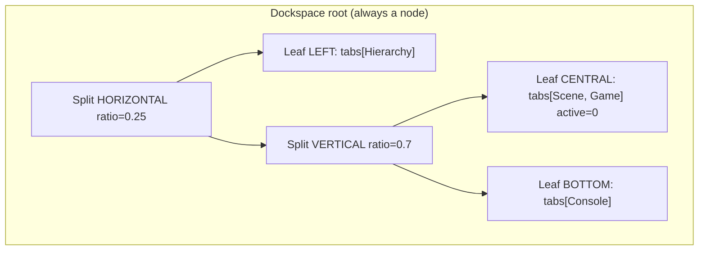
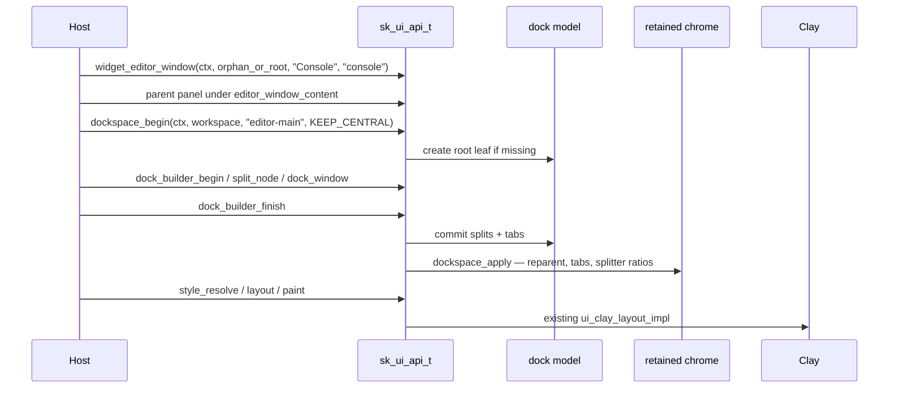
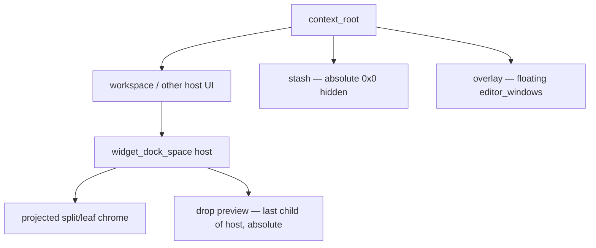

# ImGui-style docking for retained sk-ui (APX-287)

**Author:** Skore / APX-287  
**Date:** 2026-08-12  
**Status:** Draft  
**Ticket:** APX-287 — Survey Skore UI layer and write docking design spec  
**Follow-on:** later tickets implement the model, project to chrome widgets, add integration tests, and ask vision to confirm. **This ticket is spec only — no runtime behavior change.**

**API source of truth today:** `plugins/ui/ui.h` (`sk_ui_api_t`).  
**Related docs:** `docs/ui-system-design.md`, `docs/ui-plugin.md`, `docs/ui-editor-migration.md`, `docs/ui-clay-layout-callsite-audit.md`.

---

## Overview

Skore already has **retained editor chrome** (APX-235): `widget_dock_space`, `widget_dock_node`, `widget_splitter`, `widget_tab_bar`, `widget_tab`, and `widget_editor_window`. Those factories create styled, hittable nodes with stable Clay IDs. They are **not** a docking system. There is no persistable split tree, no window-id ↔ leaf-tab binding, no dock-into / undock / central node, and no DockBuilder. The editor host still places the Console as an in-flow `widget_panel` under a flex spacer (`editor/editor_ui_host.c`); tests assemble `dock_node + splitter + tab_bar` by hand.

This spec adds an **ImGui-style docking model** adapted to Skore’s **retained** tree (not immediate-mode `Begin`/`End` rebuilds). The model is a binary tree of dock nodes owned by `sk_ui_context_t`. A **projection / apply** pass maps that tree onto the existing chrome widgets. Hosts keep creating `widget_editor_window` and parenting panel content under `editor_window_content`. The dock system **reparents** those windows into leaf content slots (docked) or an overlay layer (floating). Public entry points live only as function pointers on `sk_ui_api_t`.

Agreed surface names match the ticket (`dockspace_begin` / `dockspace_end`, `dock_window_to_node`, `dock_builder_*`) but are **retained setup + apply**, not per-frame ImGui bracketing.

---

## Background & Motivation

### Why this change is needed

`docs/ui-system-design.md` §2.5 and §5 left docking **out of v1**. `docs/ui-editor-migration.md` §3.1 still lists **Docking / multi-viewport** as the blocker for an editor workspace, and §4 item 9 says: keep ImGui docking until the end **or** design a sk-ui dock host — do not block panel content ports on full docking parity.

APX-235 shipped the **chrome atoms**. That is necessary but not sufficient:

| Need | APX-235 today | Missing |
| --- | --- | --- |
| Split a region | Host creates `widget_dock_node` + `widget_splitter` + sibling | Persistable model tree; ratio does not size siblings |
| Tabs | Host creates `widget_tab_bar` / `widget_tab` | Window-id ↔ tab binding; hide inactive content |
| Window chrome | `widget_editor_window` (title + content) | Docked vs floating policy; redock |
| Layout restore | None (`docs/ui-editor-migration.md` §3.2) | Serialize split tree + window ids |
| Programmatic layout | Manual node factories | DockBuilder (`split_node` / `dock_window` / `finish`) |

The current splitter **stores** `ratio` (0..1) and fires `on_change`. It does **not** apply that ratio to sibling `flex_grow` (`ui_splitter_apply_ratio` in `plugins/ui/widgets.c` only writes the prop and marks dirty). Clay has **no native splitter** (`clay_adapter.c` file comment; `docs/ui-clay-layout-callsite-audit.md` §4). A host that wants a 30/70 split must size the dock nodes itself. That is the gap a dock **model** closes.

### Current state (survey)

Surveyed production code, not invented APIs. Details in **Survey: how windows work today**.

Pain points:

1. Every dock layout is a one-off widget assembly. Tests (`ui_widget_dock_splitter_tab_interaction`, `ui_clay_dock_space_node_splitter_stable_ids`) prove chrome, not docking.
2. Console is a retained panel, **not** a docked window (`editor/console_panel.c` uses `widget_panel`, not `widget_editor_window`).
3. Dual-stack editor (`editor_ui_host.c`) arbitrates input by **console abs rect**, not by a dockspace hit-test.
4. No layout `.ini` / JSON for workspace restore.

---

## Goals & Non-Goals

### Goals

- Document how windows are declared, drawn, hit-tested, and z-ordered **as the code exists**.
- Specify a retained ImGui-style dock node tree (binary), dockspace root, public C API, ownership, and interaction with existing window chrome.
- Agree **paste-evolvable** `sk_ui_api_t` signatures and types (`sk_ui_dock_node_t`, split/dir enums, flags).
- Keep existing chrome widgets and call sites working (additive).
- Give later PRs a concrete incremental plan (model → apply → API → undock/tabs → persist → DnD → tests/vision).

### Non-Goals (this ticket and the first implementation series)

- **No runtime behavior change in APX-287.** Do not edit `plugins/ui/*.c` or public headers except as later implementation PRs.
- Multi-viewport / multi-OS-window docking (Clay is single context root; `clay_adapter.c` APX-235 comment).
- Vendoring Dear ImGui or copying `imgui_internal` dock code.
- Replacing APX-235 chrome widgets.
- Per-frame immediate `Begin("Console")` / `End()` window API.
- Tab close **buttons** (visible × chrome) and persist-to-disk **host policy** (UI only serializes a blob; the editor chooses the path). Tab **tear-off** (dead-zone drag on a projected tab → undock) is in scope for PR 6; preview chrome can still ship after that.
- n-ary split nodes (rejected; see Alternative E).
- Changing Clay, paint, or `input_dispatch` contracts except the **listed** hooks: generalize `hidden=1` omit in Clay (PR 3 prerequisite); wrap `layout()` for `AUTO_APPLY` (PR 3); `node_destroy` / `node_set_id` dock hooks. Do **not** change `focus_set` failure mode.

---

## Survey: how windows work today

This section is an audit of HEAD. Implementers should treat file/function citations as the contract they must not break.

### 1. How windows are declared (retained chrome, not ImGui `Begin`/`End`)

Skore UI is a **retained element tree**. There is no `begin_frame` / `end_frame` on `sk_ui_api_t` (`docs/ui-plugin.md` §1.2, §10). Hosts (or `harness_step`) sequence `style_resolve` → `layout` → `layout_apply_scale` → `paint`.

**Identity.** `sk_ui_node_t` is `{ u32 index; u32 generation; }` (`plugins/ui/ui.h`). Slot 0 is invalid. `ui_alloc_node` / `ui_free_node_recursive` in `plugins/ui/ui.c` recycle indices and bump generation (skip 0). The context root is a `SK_UI_NODE_KIND_BOX` that cannot be destroyed.

**Window chrome is a factory, not a frame call.** `widget_editor_window` (`ui_widget_editor_window_impl` in `plugins/ui/widgets.c`) builds:

```text
editor_window (BOX, class ui-editor-window, widget="editor_window")
  ├─ window_title_bar (BOX, class ui-window-title-bar, id="{id}-title")
  │     prop "text" = title; callbacks: ui_window_title_on_event
  └─ window_content  (BOX, class ui-window-content, id="{id}-content", clip_children=1)
```

Accessors: `editor_window_title_bar`, `editor_window_content`, `editor_window_set_title`. The host attaches panel widgets under **content**, never under the chrome root. Console today **does not** use this factory — `sk_editor_console_panel_create` calls `widget_panel` and parents toolbar / scroll_view directly.

**Dock chrome (APX-235)** is equally retained and **host-assembled**:

| Factory | `widget` prop | Class | Behavior |
| --- | --- | --- | --- |
| `widget_dock_space` | `dock_space` | `ui-dock-space` | Row flex, 100%×100%, grow 1, `clip_children=1` |
| `widget_dock_node` | `dock_node` | `ui-dock-node` | `orientation` 0=row / 1=column; clip; grow 1; min 40×40 |
| `widget_splitter` | `splitter` | `ui-splitter` | `axis` 0=vertical bar (resize width), 1=horizontal bar; `ratio` default 0.5; pointer capture on drag |
| `widget_tab_bar` | `tab_bar` | `ui-tab-bar` | Row strip, min-height 26 |
| `widget_tab` | `tab` | `ui-tab` | BUTTON; `active` 0/1; click → `tab_bar_set_active` (sibling exclusive) |

Default styles are registered in `ui_widgets_register_defaults_impl` (called from `context_create`). File comment in `widgets.c`:

> Not full ImGui parity — no tables, trees, or multi-viewport docking.

**Title-bar drag (already dock-aware).** `ui_window_title_on_event`: left-down captures the title bar. On move, if the **parent** `editor_window` has `layout_style.position != SK_UI_POSITION_ABSOLUTE`, drag is **ignored** (still consumed). Floating windows update `left`/`top` in points. This is the existing docked-vs-floating contract the new model must preserve.

**There is no dock model.** Orientation and ratio live as node props. No tree of split/leaf records, no central node, no window-id table.

### 2. How they are drawn

Pipeline (`docs/ui-plugin.md` §8; `editor_ui_host.c` `sk_editor_ui_host_frame`):

```text
input_dispatch (0..n)
  → style_resolve          // style.c — cascade + write layout_style
  → layout(logical_w, h)   // clay_adapter.c — ui_clay_layout_impl
  → layout_apply_scale     // ui.c — logical → physical rects
  → paint(&font_params)    // paint.c — CPU draw list, physical px
  → [optional GPU] renderer_prepare / renderer_encode
```

**Style.** Classes `SK_UI_CLASS_DOCK_*`, `SK_UI_CLASS_EDITOR_WINDOW`, `SK_UI_CLASS_WINDOW_TITLE_BAR`, `SK_UI_CLASS_WINDOW_CONTENT` plus hover/active variants. Cascade: default → earlier class (base → hover → focused → active → disabled) → later class → inline (`ui.h` `style_resolve` comment).

**Layout.** Clay is the **only** solver (`ui_clay_layout_impl`). Dock surfaces always get stable Clay IDs (`ui_clay_is_dock_surface`, `ui_clay_needs_stable_id`). Nested dock / `window_content` map `clip_children` to Clay clip. Splitters are **fixed-size flex children** (6pt bar); ratio is **not** consumed by Clay.

**Floating windows.** `POSITION_ABSOLUTE` (or menu popup widgets) → Clay `floating`:

| Widget | Default `z_index` | Attach |
| --- | --- | --- |
| `editor_window` (absolute) | 50 | `CLAY_ATTACH_TO_ROOT` |
| `menu_popup` | 100 | parent (below or right) |
| `context_menu` | 200 | `CLAY_ATTACH_TO_ROOT` |
| other absolute | 0 (or explicit prop) | parent |

`z_index` is an **i32 node prop** read by `ui_clay_prop_i32` (`clay_adapter.c` ~833–868). Clay `pointerCaptureMode = CAPTURE` on floats. **Single context root — no multi-viewport.**

**Paint.** `ui_paint_node` (`paint.c`) is a **preorder DFS**: background → border → widget chrome → text → push clip if `clip_children` → children **in array order** → pop clip. Earlier siblings are **under** later ones (painter’s algorithm). Geometry is `logical × content_scale` applied once. Opacity ≤ ε skips the subtree. `hidden` is **not** consulted by paint (only automation `node_is_visible` and Clay menu-popup omit). Inactive docked windows cannot rely on `hidden=1` alone until apply generalizes omit-from-Clay (see Proposed Design).

### 3. How input is routed

Ingress is `sk_ui_input_event_t` → `input_dispatch` (`ui_input_dispatch_impl` in `plugins/ui/input.c`). This is the real host/tester path, not a test hook (`ui.h`).

**Hit-test** (`ui_hit_test_walk`):

- Walks children **reverse** (last sibling first = top).
- First finished hittable node wins (comment: “Reverse-paint DFS: first finished hittable node is top-most”).
- Honors ancestor `clip_children` (point + child border vs clip).
- `pointer_events == NONE` skips the node as a target but still walks children.
- `SK_UI_STATE_DISABLED` is not a target.
- Coordinates are **logical** layout units.
- Scroll offsets (`scroll_x` / `scroll_y`) shift children the same way paint does.

**Dispatch phases:** capture (root → parent) → target → bubble (parent → root). Enter/leave/focus are target-only. `event->consumed` stops remaining delivery.

**Pointer capture:** pointer-down sets `ctx->pointer_capture` and `ctx->active`. Moves/wheel/up route to capture while held. All buttons up clears capture. Splitters and title bars also call `pointer_capture_set` in their handlers (redundant with dispatch but keeps drag if a child consumed down).

**Focus:** tab order is tree preorder of nodes that are `focusable` and not disabled (`ui_collect_focusable` / `ui_focus_advance_impl` in `input.c`). That walk does **not** consult `hidden`, opacity, or zero-size rects (`node_is_visible` is automation-only). Left-down on a focusable hit calls `focus_set`. Keys/text go to `ctx->focus`. `wants_mouse` / `wants_keyboard` are host arbitration flags. Stashed dock windows therefore stay in tab order unless apply clears `focusable` on that subtree (see Proposed Design §5).

**Editor dual stack** (`sk_editor_ui_host_pointer`): if pointer is over the console abs rect **or** sk-ui has capture/keyboard focus → `input_dispatch`; else ImGui-path shell. Combined `want_capture_*` ORs both stacks. This is **region first-refusal**, not a shared hit stack (`docs/ui-editor-migration.md` §2.1).

### 4. How draw order is managed

| Mechanism | Who uses it | Effect |
| --- | --- | --- |
| Child array order | `paint.c` preorder; `input.c` reverse walk | Later sibling on top for **both** paint and hit-test |
| Clay `floating.zIndex` | `clay_adapter.c` only | Layout stacking of overlapping **floats** inside Clay |
| `z_index` prop | Clay mapping | **Does not** sort the engine paint/hit walks |

**Critical constraint:** engine paint and hit-test **do not sort by `z_index`**. A floating window only paints/hits above the dock tree if it is a **later sibling** (or in a later overlay container). Apply parents the **overlay** as a last child of **`context_root`** (after the workspace). Among floats, apply should keep child order consistent with `z_index`.

Clay floating attach still matters for **box placement** (absolute left/top). Drop overlays are the last child of the **dockspace host**, `POSITION_ABSOLUTE`, high `z_index` (see §3).

### 5. APX-235 vs ImGui-style docking

```text
Have (chrome atoms)                          Need (docking system)
─────────────────────                        ─────────────────────
widget_dock_space / dock_node                Binary model tree (split | leaf)
widget_splitter + ratio prop                 Ratio → sibling sizes; persist
widget_tab_bar / tab + exclusive active      window_id list + active index
widget_editor_window + title drag policy     Reparent in-flow vs absolute overlay
Stable Clay IDs for drag/resize/tab          Same IDs, generated by apply
Host-assembled tests                         dock_builder_* + dock_window_to_node
                                             Central / empty dockspace
                                             Undock / redock / close tab / reorder
                                             Serialize / deserialize layout
                                             Drop-target preview (later PR)
```

The host **must** today manually assemble `dock_space → [dock_node, splitter, dock_node]` and keep tab bars in sync with windows. That assembly becomes an **internal projection** of the model.

---

## Proposed Design

### Decision: retained model + project to existing widgets

Docking is a **second tree** (model) owned by the UI context. Chrome widgets remain the **view**. Apply is the **reconciler**. This matches retained sk-ui (stable handles, dirty flags) and reuses APX-235 / Clay / input / paint unchanged for visual behavior.

ImGui names map to C table entries (not free functions, not a `sk_ui_dock_api_t` — docking is not a process-global module):

| ImGui | Skore (`sk_ui_api_t`) | When it runs |
| --- | --- | --- |
| `DockSpace` / `BeginDockSpace` | `dockspace_begin` | Setup or cheap per-frame (idempotent) |
| `EndDockSpace` | `dockspace_end` | Apply if dirty |
| `DockBuilderSplitNode` | `dock_builder_split_node` | Builder session |
| `DockBuilderDockWindow` | `dock_builder_dock_window` / `dock_window_to_node` | Builder or runtime |
| `DockBuilderFinish` | `dock_builder_finish` | End session + apply |
| `SetNextWindowDockID` | `dock_window_to_node` | Runtime |

There is **no** ImGui `Begin("Console")` equivalent. Windows stay `widget_editor_window`.

### 1. Dock node tree (binary)

**Why binary (not n-ary).** `widget_splitter` is one handle between **two** regions. ImGui docking is binary. Collapse is “replace split with the surviving child.” An n-ary node would need n−1 splitters, coupled ratios, and a different chrome projection. Nested binary splits express any rectilinear tiling.



**Node kinds.**

| Kind | Fields |
| --- | --- |
| **Leaf** | Ordered list of window id strings; `active_index`; flags (`CENTRAL`, `NO_TAB_BAR`, …); cached chrome handles (`host`, `tab_bar`, `content_slot`) |
| **Split** | `sk_ui_dock_split_t` orientation; `ratio` in (0,1) — fraction of **first** child along the main axis; two child node handles; cached chrome (`host`, `splitter`) |

**Orientation vs existing widget props** (keep numbers identical so apply is a copy):

| Model | `widget_dock_node` `orientation` | `widget_splitter` `axis` | Children |
| --- | --- | --- | --- |
| `SK_UI_DOCK_SPLIT_HORIZONTAL` (0) | 0 (row) | 0 (vertical bar) | left, right |
| `SK_UI_DOCK_SPLIT_VERTICAL` (1) | 1 (column) | 1 (horizontal bar) | top, bottom |

`ratio` is always the fraction of **child[0]** (left or top) of the leftover span after the 6pt splitter (`ui_widget_splitter_impl` bar). Child[1] gets `1 - ratio`. Apply does **not** use percent widths (Clay drops max on percent axes; percent + 6pt bar overflows the parent). Normative sizing is in §3.

**Dir → child index and stored ratio** (used by `dock_builder_split_node` and `dock_window_to_node` edge docks). `r` is the caller’s “size toward `dir`” (ImGui `size_ratio_for_node_at_dir`):

| `dir` | New leaf index | Opposite (existing) index | Stored `model.ratio` |
| --- | --- | --- | --- |
| `LEFT` | child[0] | child[1] | `r` |
| `UP` | child[0] | child[1] | `r` |
| `RIGHT` | child[1] | child[0] | `1 - r` |
| `DOWN` | child[1] | child[0] | `1 - r` |
| `CENTER` / `NONE` / `TAB` | — | — | **Rejected** on `dock_builder_split_node` (non-zero). On `dock_window_to_node` these mean tab-append, not split. |

Default `r`: **0.25** when docking a window to an existing leaf/split **edge**; **0.5** when splitting a leaf in half from the builder with no other hint. Clamp `r` so each child’s leftover ≥ 40pt when the parent span is large enough (`SK_UI_CLASS_DOCK_NODE` min).

**Handles.** `sk_ui_dock_node_t` is the same generation-handle shape as `sk_ui_node_t` (`index == 0` invalid). Separate slot array in the context — a dock node is **not** a UI node. Chrome `sk_ui_node_t`s hang off the slot. Recycle + bump generation like `ui_alloc_node`.

**Central / empty dockspace.**

- `dockspace_begin` / `dockspace_create` create a dockspace whose **root starts as a single leaf** flagged `SK_UI_DOCK_NODE_CENTRAL`.
- `SK_UI_DOCKSPACE_KEEP_CENTRAL` is **not** an API default (`flags=0` leaves it off). The editor migration snippet **passes the bit** as a host default for `"editor-main"`. When the bit is set, emptying the central leaf does **not** destroy that leaf. The leaf stays as an empty content hole (optional `SK_UI_DOCKSPACE_PASSTHRU_CENTER` → `pointer_events=NONE` on the empty content slot so clicks fall through to a 3D viewport later).
- **Split identity (mandatory):** splitting a **leaf** allocates a **new** split slot. The original leaf handle becomes the **opposite** child and **keeps** `SK_UI_DOCK_NODE_CENTRAL` if it had it. The new dir leaf is never central. The new split is **not** flagged CENTRAL. The dockspace `root` handle is updated if the old root leaf was replaced by this new split.
- **Walk-to-central:** given a split, DFS descendants for the first node with `SK_UI_DOCK_NODE_CENTRAL`. If none, the call is an expected failure (non-zero / `SK_UI_DOCK_NODE_INVALID`). Do not invent a center.
- **Collapse:** if a split has one empty child, replace the split with the remaining child and recycle the empty leaf + the split slot. **Never destroy a CENTRAL leaf** when `KEEP_CENTRAL` is set on that dockspace — the empty central leaf stays (the split may still collapse around it). If `KEEP_CENTRAL` is clear, an empty central leaf may collapse like any other.
- A dockspace with no windows and `KEEP_CENTRAL` is a valid empty workspace.

**Ids for persistence.** Persist **strings**, never raw handles:

- Dockspace: caller `id` (`"editor-main"`).
- Windows: `node_set_id` / factory `id` on `widget_editor_window` (`"console"`, `"hierarchy"`).
- Split/leaf nodes: optional **stable string labels** assigned by the builder (`dock_builder_set_node_id`) for tests and targeted `dock_window_to_node`. If unset, persist uses a path like `root/0/1` (first/second child walk). Runtime `sk_ui_dock_node_t` handles are **not** saved.

### 2. Dockspace root

**How many?** **One primary dockspace per `sk_ui_context_t` is the editor default.** Additional **named** dockspaces are allowed (max 8) for nested tools (e.g. a modal graph editor with its own tiling). Justification: ImGui allows multiple `DockSpace` widgets; Skore’s Clay/context is already one tree, so extra dockspaces are just extra host nodes + model roots. The “current” dockspace is whatever `dockspace_begin` last selected (builder and `dock_window_to_node` default to it).

Hosts that open a **new** `id` per modal must call `dockspace_destroy` when the modal closes; otherwise the 8-slot table fills for the process lifetime. Re-`begin` the **same** `id` rebinds and does not leak.

**Host node.** `dockspace_begin(ctx, host, id, flags)`:

- If `id` already exists: rebind as current. `host == SK_UI_NODE_INVALID` keeps the previous host. A **different** valid `host` than the one stored is an expected failure (non-zero / `SK_UI_DOCK_NODE_INVALID`). Do not silently reparent the `widget_dock_space`.
- Else create a model root leaf + ensure a `widget_dock_space` under `host` (or `context_root` if host invalid) with that `id`.
- Size: the dock_space class is already 100% × 100% flex_grow 1 — **fill parent**. Hosts that need an explicit logical rect set inline width/height on the host or the dock_space node (no separate rect API).
- Returns the **root `sk_ui_dock_node_t`**.

**`begin` / `end` vs `create` + `apply`.** Chosen surface:

- `dockspace_begin` / `dockspace_end` are the **agreed ticket names**.
- They are **not** ImGui per-frame rebuilds. `begin` is lookup-or-create + set current. `end` calls `dockspace_apply` **only for the current dockspace** if that model is dirty.
- `dockspace_create` is an explicit constructor (same as first `begin`).
- `dockspace_apply` is the real reconciler. `dockspace_destroy` tears a named space down (see API).
- Calling `begin`/`end` every frame is **legal and cheap** when clean. Calling them once at editor init is enough for **setup**. Interactive mutations do **not** wait for a later `end` (next subsection).

**Apply timing (one rule).**

| Trigger | Builder closed | `dock_builder_open` |
| --- | --- | --- |
| `dock_window_to_node`, `dock_window_undock`, `dock_tab_close`, `dock_tab_reorder`, `dock_tab_set_active`, `dock_split_set_ratio` | Mutate model, **apply immediately** | Mutate model, **do not apply** |
| Splitter `on_change` (user drag) | Write `model.ratio`, **apply immediately** | N/A (chrome not rebuilt mid-session) |
| Projected tab click → `dock_tab_set_active` | Same as row above | Same as row above |
| `ui_dock_on_window_destroy` / pending-bind resolve via `node_set_id` | Mutate, **apply immediately** | Mutate, **do not apply** |
| `dockspace_end` | Apply **current** dockspace if dirty | Apply current if dirty (rare; prefer `finish`) |
| `dock_builder_finish` | — | Close session, **always apply** that dockspace |
| `dock_layout_load` / `dock_layout_load_json` | Replace model, apply | **Error** (non-zero); session stays open |
| `dockspace_apply` (explicit) | Apply the argument (or current if invalid) | Allowed (host force-flush); does not close the session |
| `layout()` + `SK_UI_DOCKSPACE_AUTO_APPLY` | If dirty, apply **before** Clay | Skip (builder owns the tree) |

`SK_UI_DOCKSPACE_AUTO_APPLY` is a **forgotten-`end` safety net** for setup, not the interactive path. Default **off** (`flags=0`). PR 3 wraps `layout` / the start of `ui_clay_layout_impl`: if any dockspace is dirty and has the flag, `dockspace_apply` then Clay. Never mutate the tree mid-Clay walk.

Apply writes the splitter `"ratio"` prop through an internal `fire_cb=0` path (`ui_splitter_apply_ratio` already has this). Do **not** call public `splitter_set_ratio` from apply (that always fires `on_change` and would recurse).



### 3. Projection onto APX-235 widgets

Apply walks the model and **reconciles** chrome. It creates/reuses/destroys **dock chrome only** — never `node_destroy`s a host `editor_window`.

**Apply teardown invariant (mandatory).** `ui_free_node_recursive` destroys **all descendants**. Chrome destroy is **unsafe** while any host window is still a child. Before destroying or recycling any projected chrome node (`dock_node`, content slot, tab_bar, dock_space subtree being replaced):

1. Walk that subtree and `node_reparent` every descendant with `widget=="editor_window"` to the stash (or to the overlay if that window is floating).
2. Only then `node_destroy` recycled chrome.
3. PR 3 test: after `dock_layout_load_json` and after a collapse, the same `editor_window` handle remains `node_alive`.

**Handle reuse (mandatory).** A model slot’s `host`, `splitter`, `tab_bar`, and **per-window-id tab** nodes are created **once** and kept across apply as long as that slot/tab exists. Do not recreate the splitter mid-drag (`pointer_capture` + `ui_widget_data_t.dragging` live on that node). Never `node_destroy` a node that is `ctx->pointer_capture` or `ctx->focus`. Bind `splitter_set_on_change` **once** when the splitter is first created. Clay stable string ids are not a substitute for stable `sk_ui_node_t` handles. PR 3 test: drag a splitter across two `layout` frames without losing capture.

**Split node →**

```text
widget_dock_node (orientation = split, id = "{space}/{path}")
  ├─ [apply child 0]
  ├─ widget_splitter (axis = split, ratio = model.ratio, flex_grow = 0, 6pt bar)
  └─ [apply child 1]
```

Splitter `on_change` is bound once to an internal handler that writes `model.ratio` and **applies immediately** (builder closed). Apply then sizes the two child hosts with this **normative** algorithm only:

- Parent split `dock_node` is row (`HORIZONTAL`) or column (`VERTICAL`).
- Child[0] `flex_grow = model.ratio`, child[1] `flex_grow = 1 - model.ratio`.
- Cross axis: height 100% on a row split, width 100% on a column split.
- Splitter: 6pt on the main axis, `flex_grow = 0`, `flex_shrink = 0`.
- Clamp `model.ratio` so each child’s *allocated leftover* (parent main-axis minus 6pt) is ≥ 40pt when the parent span is large enough. If the parent is smaller than 86pt, clamp to `[0,1]` only.
- **Do not** set percent widths/heights on the split children.

Integration assert: abs-rect main-axis ratio within ±2pt of `model.ratio` after leftover.

**Leaf node →**

```text
widget_dock_node (column, id = "{space}/{path}")
  ├─ widget_tab_bar          // omitted if NO_TAB_BAR or 0 tabs + empty hole
  │     widget_tab × N       // label = editor_window title; id = "{window_id}-dock-tab"
  └─ content slot (view)
        └─ active editor_window (in-flow, position RELATIVE)
```

Rules:

- Tab order = model tab list. Apply calls `tab_bar_set_active` on the tab matching `active_index` (chrome state only).
- **Projected tabs replace `on_click`.** Apply installs a dock-owned handler that calls `dock_tab_set_active(window_id)` → model update → **immediate apply** (reparent, stash, `tab_bar_set_active`). Manual `widget_tab` / `widget_tab_bar` trees **outside** a dockspace keep today’s sibling-only `ui_tab_on_click` → `ui_tab_bar_set_active_impl` behavior.
- Only the **active** `editor_window` is parented under the content slot.
- Docked window: `position = RELATIVE`, width/height 100%, grow 1; **title bar `hidden=1`** (tab strip shows the title). Title-bar drag remains the **floating** path only (`ui_window_title_on_event` already no-ops when not absolute). Undock-from-docked is a **tab** dead-zone drag (PR 6).
- `editor_window_content` remains the host attachment point. Apply never inspects or moves grandchildren of content.

**Stash, overlay, and drop (layout is complete — not “0×0 by parenting”).**

`widget_dock_space` is **row flex, 100%×100%, grow 1, `clip_children=1`**. Extra **in-flow** children participate in that row and break the split. `pointer_events=NONE` on a parent still **walks children** (`ui_hit_test_walk`). Paint does not read `hidden`. Therefore:

| Layer | Parent | Layout | Interaction |
| --- | --- | --- | --- |
| Projected split/leaf chrome | **First children of** `widget_dock_space` (the dockspace host) | In-flow flex | Normal |
| **Drop preview** | **Last child of the dockspace host** (not a child of the float overlay) | `POSITION_ABSOLUTE`, `flex_grow=0`, `z_index=300`, sized to the host content box | `pointer_events=AUTO` only while a dock drag is live; otherwise `NONE` + `hidden=1` |
| **Stash** | **Last-but-one child of `context_root`** (sibling of the workspace, not inside the flex host) | `POSITION_ABSOLUTE`, `flex_grow=0`, `width/height=0`, `clip_children=1`, `hidden=1` | Stash parent `pointer_events=NONE`. **Each** stashed `editor_window` also gets `pointer_events=NONE` and `focusable=0` (subtree). |
| **Overlay (floats)** | **Last child of `context_root`** | `POSITION_ABSOLUTE`, `flex_grow=0`, `pointer_events=AUTO` | Floating `editor_window`s are children here: absolute, `z_index≥50`, title bar visible |

Clay **`hidden=1` omit for every node** (not only closed menu popups) is a **PR 3 prerequisite**, not an optional hook. Implementation: if `hidden!=0`, `ui_clay_zero_subtree` and skip the Clay declare (same as `ui_clay_menu_is_open==0`). Until that lands, stash still has 0×0 + clip + per-window `pointer_events=NONE`.



Child order under **root** (stash then overlay) and under **host** (tree then drop) is the engine z-order contract. Among floats, keep overlay child order consistent with `z_index`.

**Floating window** (child of overlay): left/top from last undock position or a cascade offset (32pt × float count). Width/height last known size or 360×240 default. Title-bar drag uses the existing absolute path.

### 4. Runtime dock / undock algorithm

**Flags.** Runtime `SK_UI_DOCKSPACE_NO_SPLIT` / `SK_UI_DOCK_NODE_NO_SPLIT`: `dock_window_to_node` with LEFT/RIGHT/UP/DOWN returns non-zero (no mutate). Runtime `SK_UI_DOCKSPACE_NO_UNDOCK` / `SK_UI_DOCK_NODE_NO_UNDOCK`: `dock_window_undock` and tab tear-off return non-zero. **Builder ignores these flags** (programmatic layouts may still split/dock) — document that override; `finish` still applies.

`dock_window_to_node(ctx, window_id, node, dir)`:

1. Empty `window_id` or dead `node` → non-zero.
2. Resolve `window_id` → live `editor_window` via `find_by_id`. If missing, append a **pending bind** `{ window_id, node, dir }` (cap `SK_UI_DOCK_PENDING_MAX` = 64; overflow → non-zero + warn). Return 0. Pending resolves at the **start of every apply** and from `node_set_id` when the new id matches (both **create-then-dock** and **load-then-create** work).
3. Remove `window_id` from any current leaf (may collapse that leaf).
4. If `dir` is `CENTER` / `NONE` / `TAB`: target must be a leaf, or a split whose DFS finds a `CENTRAL` descendant (Issue 7). No central → non-zero. Append the tab; set `active_index` to the new tab.
5. If `dir` is LEFT/RIGHT/UP/DOWN: use the **dir → index / `model.ratio`** table in §1 with default `r=0.25`. If `node` is a leaf, allocate a **new split**; original leaf becomes the opposite child and **keeps CENTRAL**; new dir leaf gets the window. If `node` is a split, split that node the same way (new split replaces it; existing split subtree is the opposite child).
6. Mark dirty; **apply immediately** unless a builder session is open.

`dock_window_undock`:

1. Remove from leaf (collapse if needed).
2. Reparent window to the **overlay** (context-root last child); set `POSITION_ABSOLUTE` + `z_index=50`; show title bar; restore `focusable` on the subtree.
3. Seed left/top from the leaf’s abs rect (or pointer if mid-drag).

`dock_tab_close`: remove from the leaf (collapse if needed); window goes to stash (`hidden=1`, `pointer_events=NONE`, `focusable=0`); host callback `sk_ui_dock_tab_fn` fires (`user` + window_id). **Does not** `node_destroy` the `editor_window`. Host owns destroy of both the window node **and** any C panel object (logger sink, etc.).

`dock_tab_reorder(leaf, from, to)`: reorder the leaf’s id list; apply reorders tab_bar children (`node_set_child_index`) without recreating tab handles.

**Tab tear-off (PR 6, not title-bar).** Projected tabs install `on_event` (in addition to click): left-down capture on the tab; after an 8pt dead-zone, `dock_window_undock` and continue as a float (title bar becomes visible and takes over further move via the existing absolute path, or the overlay drag continues until up). On up, `dock_node_at_point` + `dock_window_to_node`. Title-bar drag stays **floating-only**. Splitters keep their own capture.

### 5. Interaction with the existing window API

| State | Tree | Title-bar drag | Tab strip | Content visibility | Input | Paint |
| --- | --- | --- | --- | --- | --- | --- |
| **Docked, active** | In-flow under leaf content | N/A (title `hidden=1`) | Selected; dead-zone drag tears off (PR 6) | Visible | Normal hit-test | Tree order inside leaf |
| **Docked, inactive** | Stash under context root | N/A | Present, not active | Not in Clay (hidden omit) / 0×0 | Per-window `pointer_events=NONE`, `focusable=0` | Not painted |
| **Floating** | Overlay under context root, absolute, z≥50 | Moves left/top | None on window | Visible | Later root sibling → on top of dock tree | After workspace |
| **Dragging to redock** | Floating + drop overlay (last child of **dockspace host**) | Float title-bar after tear-off | Targets highlight | Visible | Drop last under host; overlay last under root | Drop on dock; float on top |

**Focus.** Do **not** change `focus_set` failure mode (not a new production `-1`; `AGENTS.md`: programmer errors assert in debug, do not paper over with a status). Apply sets `focusable=0` on a stashed `editor_window` **subtree** and restores `focusable` (to the pre-stash values; title bar / tabs default as today) when the window is activated or floated. After a tab switch or stash, if `ctx->focus` is inside the outgoing window, `focus_set(SK_UI_NODE_INVALID)`. Activating a tab is explicit (`dock_tab_set_active` / projected tab click).

**Splitters.** Existing capture path stays. Bind `splitter_set_on_change` once so drags write **model** ratio and apply immediately. Programmatic `dock_split_set_ratio` writes the model then apply (apply uses `fire_cb=0` to set the widget prop).

**Draw order recap.** Docked chrome = in-host tree order. Drop preview = last child of dockspace host (absolute). Stash then overlay = last children of **context root**. Menu popups remain later root children as today. If a menu and a floating window overlap, root sibling order decides engine hit/paint.

---

## API / Interface Changes

All additions are types in `plugins/ui/ui.h` plus function pointers at the **end** of `sk_ui_api_t` (append-only ABI for a SHARED plugin). No free-function mirrors. No `sk_ui_dock_api_t`. Implementations `static` in a new `plugins/ui/dock.c`. Allocator = `ctx->allocator`. Status: `0` success, non-zero expected failure (unknown id, empty builder, persist parse). Programmer misuse (null ctx): no defensive check (`AGENTS.md`).

**Header dependency:** PR 2 does **not** `#include "serialization.h"` from `ui.h`. Persist on the PR 2 table is **JSON-only** (`dock_layout_save_json` / `dock_layout_load_json`). PR 5 may add `dock_layout_save` / `dock_layout_load` taking `sk_archive_writer_t*` / `sk_archive_reader_t*` and then include `serialization.h` (or forward-declare those structs). **One writer contract:** the archive helpers **begin and end their own named map `"dock"`**; callers do not pre-open a map. JSON helpers are the same payload via `sk_json_archive_writer_*` internally.

### Agreed types (paste-evolve)

```c
/* -------------------------------------------------------------------------- */
/*  Docking (APX-287 spec; implemented in follow-on PRs)                      */
/* -------------------------------------------------------------------------- */

/**
 * Stable dock-model handle (not a UI node). Same generation-handle rules as
 * sk_ui_node_t: index 0 is invalid; recycled slots bump generation.
 */
typedef struct sk_ui_dock_node_t {
	u32 index;
	u32 generation;
} sk_ui_dock_node_t;

#define SK_UI_DOCK_NODE_INVALID ((sk_ui_dock_node_t){0u, 0u})

SK_FINLINE i32 sk_ui_dock_node_is_valid(sk_ui_dock_node_t node) {
	return node.index != 0u;
}

SK_FINLINE i32 sk_ui_dock_node_eq(sk_ui_dock_node_t a, sk_ui_dock_node_t b) {
	return (a.index == b.index) && (a.generation == b.generation);
}

/**
 * Split orientation. Numeric values match widget_dock_node "orientation"
 * and widget_splitter "axis" (0 = row / vertical bar, 1 = column / horizontal bar).
 */
typedef enum sk_ui_dock_split_t {
	SK_UI_DOCK_SPLIT_HORIZONTAL = 0, /**< Left | right. */
	SK_UI_DOCK_SPLIT_VERTICAL = 1,	 /**< Top / bottom. */
} sk_ui_dock_split_t;

/**
 * Dock insertion direction (ImGuiDir analogue). CENTER/NONE/TAB all mean
 * "add as a tab on the target leaf".
 */
typedef enum sk_ui_dock_dir_t {
	SK_UI_DOCK_DIR_NONE = 0,
	SK_UI_DOCK_DIR_LEFT = 1,
	SK_UI_DOCK_DIR_RIGHT = 2,
	SK_UI_DOCK_DIR_UP = 3,
	SK_UI_DOCK_DIR_DOWN = 4,
	SK_UI_DOCK_DIR_CENTER = 5,
	SK_UI_DOCK_DIR_TAB = 5, /**< Alias of CENTER. */
} sk_ui_dock_dir_t;

/** dockspace_begin / dockspace_create flags. */
#define SK_UI_DOCKSPACE_NONE 0u
#define SK_UI_DOCKSPACE_KEEP_CENTRAL (1u << 0)	  /**< Empty central leaf stays. */
#define SK_UI_DOCKSPACE_NO_SPLIT (1u << 1)		  /**< Runtime split/dock-to-edge disabled. */
#define SK_UI_DOCKSPACE_NO_UNDOCK (1u << 2)		  /**< Tabs cannot tear off. */
#define SK_UI_DOCKSPACE_PASSTHRU_CENTER (1u << 3) /**< Empty central: pointer-events none. */
#define SK_UI_DOCKSPACE_AUTO_APPLY (1u << 4)	  /**< layout() applies when dirty. */

/** Per-node flags (leaf or split). */
#define SK_UI_DOCK_NODE_NONE 0u
#define SK_UI_DOCK_NODE_CENTRAL (1u << 0)
#define SK_UI_DOCK_NODE_NO_TAB_BAR (1u << 1)
#define SK_UI_DOCK_NODE_NO_SPLIT (1u << 2)
#define SK_UI_DOCK_NODE_NO_UNDOCK (1u << 3)

/** Max named dockspaces per context. */
#define SK_UI_DOCKSPACE_MAX 8u
/** Max tabs per leaf (editor workspaces stay well under this). */
#define SK_UI_DOCK_LEAF_TABS_MAX 32u
/** Max pending window-id binds per dockspace (create-then-dock / load-then-create). */
#define SK_UI_DOCK_PENDING_MAX 64u

/**
 * Tab close / undock notification. Host may destroy the editor_window.
 * @param ctx        UI context.
 * @param window_id  Stable window id (node id).
 * @param user       Pointer from dock_set_tab_callback.
 */
typedef void (*sk_ui_dock_tab_fn)(sk_ui_context_t* ctx, const_chr_t window_id, void_ptr_t user);
```

### Agreed `sk_ui_api_t` members (append)

```c
	/* ---- docking (retained model + apply; APX-287) ---- */

	/**
	 * Lookup-or-create a named dockspace under @p host (or context_root).
	 * Sets the context "current" dockspace. Idempotent. Does not require a
	 * matching end the same frame; end/apply flush projection.
	 * @return Root dock node, or SK_UI_DOCK_NODE_INVALID on failure (OOM, cap).
	 */
	sk_ui_dock_node_t (*dockspace_begin)(sk_ui_context_t* ctx, sk_ui_node_t host, const_chr_t id, u32 flags);

	/**
	 * Apply **only the current** dockspace if dirty. Safe if begin was never
	 * called (returns 0). Does not apply other named dockspaces.
	 * @return 0 on success, non-zero on apply failure (OOM).
	 */
	i32 (*dockspace_end)(sk_ui_context_t* ctx);

	/**
	 * Explicit constructor (same effect as first dockspace_begin).
	 * @return Root dock node, or SK_UI_DOCK_NODE_INVALID on failure.
	 */
	sk_ui_dock_node_t (*dockspace_create)(sk_ui_context_t* ctx, sk_ui_node_t host, const_chr_t id, u32 flags);

	/**
	 * Project the model for @p dockspace (or current if invalid) onto chrome
	 * widgets. Reparents editor_windows; does not destroy them.
	 * @return 0 on success.
	 */
	i32 (*dockspace_apply)(sk_ui_context_t* ctx, sk_ui_dock_node_t dockspace);

	/** Root model node for a named dockspace, or INVALID. */
	sk_ui_dock_node_t (*dockspace_find)(const sk_ui_context_t* ctx, const_chr_t id);

	/** Chrome widget_dock_space node for a dockspace root. */
	sk_ui_node_t (*dockspace_host_node)(const sk_ui_context_t* ctx, sk_ui_dock_node_t dockspace);

	/**
	 * Destroy a named dockspace: reparent every widget=="editor_window"
	 * descendant to stash (then overlay floats stay on the overlay), tear
	 * projected chrome, free the model slot. Same id may begin again.
	 * @return 0 on success, non-zero if id is unknown.
	 */
	i32 (*dockspace_destroy)(sk_ui_context_t* ctx, const_chr_t id);

	/**
	 * Dock @p window_id onto @p node. CENTER/NONE/TAB appends a tab (leaf, or
	 * DFS CENTRAL descendant of a split). LEFT/RIGHT/UP/DOWN split using the
	 * dir→index / model.ratio table. Missing window → pending bind (cap 64).
	 * Runtime NO_SPLIT + edge dir → non-zero. Applies immediately unless a
	 * builder session is open.
	 * @return 0 on success, non-zero if window_id is empty / node dead / no central / flag.
	 */
	i32 (*dock_window_to_node)(sk_ui_context_t* ctx, const_chr_t window_id, sk_ui_dock_node_t node, sk_ui_dock_dir_t dir);

	/**
	 * Tear @p window_id out of the tree as a floating editor_window.
	 * @return 0 on success, non-zero if not docked / unknown id.
	 */
	i32 (*dock_window_undock)(sk_ui_context_t* ctx, const_chr_t window_id);

	/**
	 * Remove the tab. Window is stashed (hidden); host callback fires.
	 * Does not node_destroy the editor_window.
	 * @return 0 on success, non-zero if unknown id.
	 */
	i32 (*dock_tab_close)(sk_ui_context_t* ctx, const_chr_t window_id);

	/** Reorder tabs on a leaf. @return 0 on success. */
	i32 (*dock_tab_reorder)(sk_ui_context_t* ctx, sk_ui_dock_node_t leaf, u32 from_index, u32 to_index);

	/** Activate the tab for @p window_id. @return 0 on success. */
	i32 (*dock_tab_set_active)(sk_ui_context_t* ctx, const_chr_t window_id);

	/** Host hook for close (and optional undock). NULL clears. */
	void (*dock_set_tab_callback)(sk_ui_context_t* ctx, sk_ui_dock_tab_fn fn, void_ptr_t user);

	/* ---- dock builder (ImGui DockBuilder* analogue) ---- */

	/**
	 * Open a builder session on @p dockspace (INVALID = current).
	 * Public mutators other than dock_builder_* mutate the model but do not
	 * apply until finish. Nested begin is a programmer error: **debug assert
	 * only** (no production non-zero).
	 * @return 0 on success.
	 */
	i32 (*dock_builder_begin)(sk_ui_context_t* ctx, sk_ui_dock_node_t dockspace);

	/**
	 * Split @p node. @p ratio is the fraction kept by the child toward @p dir
	 * (ImGui size_ratio_for_node_at_dir). Converted to first-child model.ratio
	 * via the dir table (LEFT/UP store r; RIGHT/DOWN store 1-r).
	 * CENTER/NONE/TAB → non-zero. out_* may be NULL. @return 0 on success.
	 */
	i32 (*dock_builder_split_node)(sk_ui_context_t* ctx, sk_ui_dock_node_t node, sk_ui_dock_dir_t dir, f32 ratio, sk_ui_dock_node_t* out_at_dir, sk_ui_dock_node_t* out_opposite);

	/**
	 * Tab-append @p window_id on a **leaf**. If @p node is a split, resolve to
	 * the CENTRAL descendant or return non-zero. No dir parameter — edge
	 * docking is split_node then dock_window on out_at_dir. @return 0 on success.
	 */
	i32 (*dock_builder_dock_window)(sk_ui_context_t* ctx, const_chr_t window_id, sk_ui_dock_node_t node);

	/** Optional stable string id for persist / tests. Copies @p id. */
	i32 (*dock_builder_set_node_id)(sk_ui_context_t* ctx, sk_ui_dock_node_t node, const_chr_t id);

	i32 (*dock_builder_set_node_flags)(sk_ui_context_t* ctx, sk_ui_dock_node_t node, u32 flags);

	/**
	 * Close the session and dockspace_apply. @return 0 on success.
	 */
	i32 (*dock_builder_finish)(sk_ui_context_t* ctx);

	/* ---- queries ---- */

	/**
	 * Leaf (or split host) under logical (x,y), plus suggested drop dir
	 * (CENTER if inside the inner 60%, else nearest edge).
	 * out_dir may be NULL.
	 */
	sk_ui_dock_node_t (*dock_node_at_point)(const sk_ui_context_t* ctx, f32 x, f32 y, sk_ui_dock_dir_t* out_dir);

	/** Leaf that currently owns @p window_id, or INVALID if floating/unknown. */
	sk_ui_dock_node_t (*dock_find_node_for_window)(const sk_ui_context_t* ctx, const_chr_t window_id);

	/**
	 * Copy up to @p max_out window ids from a leaf into @p out_ids (pointers
	 * into model-owned strings; valid until next apply/destroy).
	 * out_count / out_active may be NULL.
	 * @return 0 on success, non-zero if @p leaf is not a live leaf.
	 */
	i32 (*dock_leaf_tabs)(const sk_ui_context_t* ctx, sk_ui_dock_node_t leaf, const_chr_t* out_ids, u32 max_out, u32* out_count, u32* out_active);

	i32 (*dock_node_is_leaf)(const sk_ui_context_t* ctx, sk_ui_dock_node_t node);
	i32 (*dock_node_is_split)(const sk_ui_context_t* ctx, sk_ui_dock_node_t node);
	/**
	 * Split axis. Dead or leaf @p node → SK_UI_DOCK_SPLIT_HORIZONTAL (0).
	 * (i32 booleans match node_alive style.)
	 */
	sk_ui_dock_split_t (*dock_split_get_axis)(const sk_ui_context_t* ctx, sk_ui_dock_node_t node);
	/**
	 * First-child ratio. Dead or leaf @p node → 0.f.
	 */
	f32 (*dock_split_get_ratio)(const sk_ui_context_t* ctx, sk_ui_dock_node_t node);
	/** Write model.ratio (clamped) and apply immediately unless builder open. */
	i32 (*dock_split_set_ratio)(sk_ui_context_t* ctx, sk_ui_dock_node_t node, f32 ratio);
	sk_ui_dock_node_t (*dock_split_child)(const sk_ui_context_t* ctx, sk_ui_dock_node_t node, u32 index);
	sk_ui_node_t (*dock_node_host)(const sk_ui_context_t* ctx, sk_ui_dock_node_t node);

	/** Non-zero if @p window_id is in a leaf (not floating / unknown). */
	i32 (*dock_window_is_docked)(const sk_ui_context_t* ctx, const_chr_t window_id);

	/* ---- persist (PR 2: JSON only. PR 5 may add archive pointers.) ---- */

	/**
	 * Emit pretty JSON for the dockspace into @p out (null-terminated).
	 * @p out_len receives bytes written excluding NUL. @return 0 on success.
	 */
	i32 (*dock_layout_save_json)(const sk_ui_context_t* ctx, const_chr_t dockspace_id, char* out, u32 cap, u32* out_len);

	/**
	 * Replace the named dockspace model from JSON. Fails if version != 1.
	 * Missing windows become pending binds. Error if a builder session is open.
	 * Does not destroy editor_window nodes (teardown reparents first).
	 * @return 0 on success, non-zero on parse / schema error.
	 */
	i32 (*dock_layout_load_json)(sk_ui_context_t* ctx, const_chr_t dockspace_id, const_chr_t json, u32 len);

	/* PR 5 only — do not name these in ui.h until serialization.h is included:
	 *   i32 (*dock_layout_save)(const sk_ui_context_t* ctx, const_chr_t dockspace_id, sk_archive_writer_t* writer);
	 *   i32 (*dock_layout_load)(sk_ui_context_t* ctx, const_chr_t dockspace_id, sk_archive_reader_t* reader);
	 * Each begins/ends its own named map "dock". Same payload as JSON.
	 */
```

### Persist format (high level)

Normative schema: `docs/ui-dock-layout-format.md` and the types
`sk_ui_dock_layout_t` / `sk_ui_dock_layout_node_t` / `sk_ui_dock_layout_float_t`
in `plugins/ui/ui.h`. Version policy: unknown/newer and older documents are
**rejected** (no migration); load logs the encountered version and the host
falls back to the default layout.

JSON object (yyjson via `sk_json_archive_writer_*` in `core/serialization.h`):

```json
{
  "version": 1,
  "id": "editor-main",
  "flags": 1,
  "root": {
    "kind": "split",
    "axis": 0,
    "ratio": 0.25,
    "id": "root",
    "flags": 0,
    "a": { "kind": "leaf", "id": "left", "flags": 0, "tabs": ["hierarchy"], "active": "hierarchy" },
    "b": {
      "kind": "split",
      "axis": 1,
      "ratio": 0.72,
      "a": { "kind": "leaf", "id": "central", "flags": 1, "tabs": ["scene", "game"], "active": "scene" },
      "b": { "kind": "leaf", "id": "bottom", "flags": 0, "tabs": ["console"], "active": "console" }
    }
  },
  "floating": [
    { "id": "profiler", "x": 80, "y": 60, "w": 360, "h": 240, "z": 50 }
  ]
}
```

- `version` is a single integer. Load **fails** (non-zero) if `version != 1`. There is no major.minor. Newer and older versions are **rejected** (no migration); corrupt JSON is rejected the same way. The live tree is left unchanged so the host keeps the default layout. See the table in `docs/ui-dock-layout-format.md`.
- `tabs` / `active` are **window id strings**, not handles.
- Serialized ids that are neither live nor `dock_window_register`'d are **dropped** and empty leaves / empty splits **collapse** (parent split → surviving sibling; leftover sibling ratios renormalized; cascade through nested empties).
- Registered windows missing from the document use their declared default dock target, or float at the declared rect when they have no target (or the target collapsed).
- Registered-but-not-yet-created ids that *are* in the document become pending binds (`ui_dock_pending_t`, cap 64).
- Extra fields ignored (forward compatible) **within** the current version.
- PR 5 archive helpers write the same fields inside a self-contained named map `"dock"`.

---

## Data Model Changes

No ECS components. No repository type required for v1 of docking (host may later store the JSON on a settings RID).

### Context additions (`ui_internal.h`, not public)

```c
typedef struct ui_dock_slot_t {
	u32 generation;
	u8 alive;
	u8 kind; /* 0 leaf, 1 split */
	u32 flags;
	sk_ui_dock_node_t parent;
	/* split */
	sk_ui_dock_split_t axis;
	f32 ratio;
	sk_ui_dock_node_t child[2];
	/* leaf */
	char* tabs[SK_UI_DOCK_LEAF_TABS_MAX];
	u32 tab_count;
	u32 active_index;
	char* stable_id;
	/* projected chrome (INVALID until apply) */
	sk_ui_node_t host;
	sk_ui_node_t splitter;
	sk_ui_node_t tab_bar;
	sk_ui_node_t content;
} ui_dock_slot_t;

typedef struct ui_dock_pending_t {
	char* window_id;		 /**< Copied; matches node_set_id / find_by_id. */
	sk_ui_dock_node_t node;
	sk_ui_dock_dir_t dir;
} ui_dock_pending_t;

typedef struct ui_dockspace_t {
	char* id;
	u32 flags;
	u8 dirty;
	sk_ui_dock_node_t root;
	sk_ui_node_t host;	 /* widget_dock_space (projected tree + drop last) */
	sk_ui_node_t drop;	 /* last child of host; absolute */
	ui_dock_pending_t pending[SK_UI_DOCK_PENDING_MAX];
	u32 pending_count;
} ui_dockspace_t;

/* Per context (not per dockspace): stash + overlay are last children of context_root. */
/* sk_ui_node_t dock_stash; sk_ui_node_t dock_overlay; */

/* on sk_ui_context_t: */
/* ui_dock_slot_array_t dock_slots; ui_freelist_t dock_freelist; */
/* ui_dockspace_t dockspaces[SK_UI_DOCKSPACE_MAX]; u32 dockspace_count; */
/* sk_ui_dock_node_t dock_current; i32 dock_builder_open; */
/* SK_HASH_MAP(const_chr_t, sk_ui_dock_node_t) dock_window_map; */
/* SK_HASH_MAP(const_chr_t, sk_ui_node_t) dock_tab_nodes; */ /* window_id → reused tab handle */
/* sk_ui_dock_tab_fn dock_tab_cb; void_ptr_t dock_tab_user; */

/* Resolve pending: at start of dockspace_apply, find_by_id each window_id.
 * Also from node_set_id (ui.c) when the new id matches a pending entry. */
```

Cold strings (ids, tab lists) live on the context allocator. Hot apply walks a few dozen nodes — not a gameplay inner loop.

### Migration of existing data

None. No on-disk layout exists. First editor run builds a default via `dock_builder_*`. Subsequent runs `dock_layout_load_json` if the host has a file.

Chrome widgets keep their props (`orientation`, `axis`, `ratio`, `active`). Apply is the writer; hosts must not fight it on projected nodes. Direct `widget_dock_*` call sites **outside** a dockspace continue to work (no model attached).

---

## Ownership / Lifetime

| Object | Owner | Destroyed when |
| --- | --- | --- |
| Dock model slots + dockspace records | `sk_ui_context_t` | `context_destroy` |
| Projected dock chrome (`dock_space`, `dock_node`, `splitter`, `tab_bar`, `tab`) | Context tree; **created once, reused, destroyed by apply only after teardown** | Apply teardown / `dockspace_destroy` / context destroy |
| `widget_editor_window` + user content | **Host** | Host `node_destroy` or context destroy |
| Window id strings in the model | Context (copies) | Tab remove / context destroy |
| Builder session | Context (one at a time) | `dock_builder_finish` or `context_destroy` |
| Persist blob | Host (file / settings) | Host policy |

Rules:

1. Apply **never** `node_destroy`s an `editor_window`. Before any chrome `node_destroy`, reparent every descendant with `widget=="editor_window"` to stash (or overlay if floating). Chrome destroy is unsafe while a host window is still a child.
2. Host `node_destroy` on a docked window: `ui_input_on_node_destroy` already clears hover/focus/capture. Dock hooks `ui_free_node_recursive`: if `widget==editor_window` and id is in `dock_window_map`, `ui_dock_on_window_destroy` drops the tab and may collapse. Apply immediately unless builder open.
3. Empty non-central leaf → collapse split (recycle chrome **after** teardown). Empty CENTRAL leaf + `KEEP_CENTRAL` → keep that leaf forever. Empty dockspace + no `KEEP_CENTRAL` → root becomes an empty leaf.
4. Nested `dock_builder_begin`: debug assert only. `context_destroy` discards an open session. Internal `dock_builder_cancel` may exist; public cancel is not required (`finish` on a no-op session just applies).
5. Persist ids are strings. Live `dock_layout_load_json` replaces the **model**, then apply teardown-reparents windows and rebuilds chrome. Error if builder is open.
6. `dockspace_destroy(id)` is how a modal releases a named slot. Same id may `begin` again.

---

## Alternatives Considered

### A. Keep host-assembled chrome only (no model)

**Idea:** Document the APX-235 widgets as the docking API. Editor writes its own split tree in C.

**Pros:** Zero new API; already shipping.  
**Cons:** Every host duplicates split/collapse/tab-bind/persist. Splitter ratio does not size panes. No `DockBuilder` analogue. Ticket explicitly asks for a model + public surface.  
**Rejected** as the product docking design. Chrome stays as the **view**.

### B. Vendor Dear ImGui docking

**Idea:** Rehost ImGui (or copy `imgui_internal` dock) beside sk-ui.

**Pros:** Full docking + multi-viewport + ini. Matches main-branch editor.  
**Cons:** C++ in the UI path; second input/paint stack; fights retained tree; `AGENTS.md` forbids new third-party unless explicitly requested; `docs/ui-system-design.md` already rejected ImGui_Impl* against raw Vulkan. Dual-stack already exists as a **migration** aid, not the destination.  
**Rejected** for sk-ui docking. ImGui-path shell remains for unported panels until they move.

### C. Retained dock model + project to existing widgets (**chosen**)

**Idea:** Binary model in the context; apply generates APX-235 chrome; hosts keep `widget_editor_window`.

**Pros:** C-idiomatic; allocator-aware; reuses Clay/input/paint; chrome tests stay valid; persist is a small JSON tree; incremental PRs.  
**Cons:** Apply complexity; Clay has no splitter (ratio → flex_grow is a mapping); no multi-viewport.  
**Accepted.** Cons are already Clay limitations, not introduced by docking.

### D. Immediate `BeginDockSpace` that rebuilds chrome every frame

**Idea:** Fake ImGui in retained clothing.

**Pros:** Familiar names.  
**Cons:** Fights dirty flags, stable Clay IDs, and widget user_data. Title-bar capture would reset. Explicitly against the retained model in `docs/ui-plugin.md`.  
**Rejected.** `dockspace_begin`/`end` are retained bind + apply.

### E. n-ary split nodes

**Idea:** One split node with N children and N−1 splitters (or a list of ratios that sum to 1).

**Pros:** A three-pane row is one node instead of two nested binaries; slightly closer to some IDE “grid” UIs.  
**Cons:** `widget_splitter` is one handle between **two** regions — n-ary needs N−1 coupled ratios and a different projection; collapse/undo is messier; ImGui docking is binary; persist schema grows. Nested binary splits already express any rectilinear tiling.  
**Rejected.** Non-Goals point here.

---

## Security & Privacy Considerations

| Threat | Severity | Mitigation |
| --- | --- | --- |
| Persist JSON from disk is untrusted | Medium | `dock_layout_load` fails closed on bad version / overlong strings / tab_count > 32; no eval; yyjson parse errors → non-zero |
| Window id injection into Clay id strings | Low | Apply sanitizes path fragments the same way widget auto-ids do (existing `node_set_id` uniqueness); ids are host-authored |
| Overlay stealing all hits | Medium | Drop overlay `pointer_events=NONE` when not dragging; stash 0×0 + per-window NONE |
| Focus into hidden tab (key events to invisible fields) | Medium | Apply `focusable=0` on stash subtree; clear `ctx->focus` on hide; **no** `focus_set` contract change |
| No secrets in layout | — | Layout is geometry + window ids only |

Auth is N/A (in-process editor UI). No network. Allocator failure returns non-zero; no `malloc` on the apply hot path beyond existing `SK_ARRAY` growth at known mutation boundaries.

---

## Observability

**Logging** (`core/logger.h`):

- `dockspace_begin` create / reuse (debug).
- Apply collapse / pending bind resolution (debug).
- Persist load failure: warn with schema reason (version, overflow, missing root).
- Clay limitation logs stay once-per-context (`ui_clay_log_limitation`).

**Metrics (optional counters on the context, test-visible):**

- `dockspace_count`, `dock_leaf_count`, `dock_split_count`, `dock_pending_binds`.
- `dock_apply_count` / last apply time (debug builds).

**Alerts:** none in-engine. Editor host may toast persist load failure.

**Tests as observability:** unit tests dump model via `dock_leaf_tabs` + `dock_split_get_ratio`; integration harness uses `query_by_test_id` on generated tab ids (`{window_id}-dock-tab`).

---

## Rollout Plan

APX-287 is spec-only. Implementation is additive and flaggable.

1. **Land model + tests with no editor hookup** — default unused; `dockspace_count==0` → zero cost on `layout`/`paint`.
2. **Editor opt-in** behind a host flag (e.g. `sk-editor --dock-ui`) that builds a dockspace and docks Console; existing flex spacer path remains default until green.
3. **AUTO_APPLY** only on the editor dockspace after apply is trusted.
4. **Persist** after the default builder layout is stable; missing file → builder default (not a hard fail).
5. **Drag-drop redock** last (needs overlay + hit `dock_node_at_point`).
6. **Rollback:** stop calling `dockspace_begin`; destroy context as today. Chrome-only call sites never attached to a model.

No feature-flag bit inside `sk_ui_api_t` is required; unused function pointers stay NULL until the API PR fills them (or filled no-ops returning `-1` / INVALID so older hosts that dlsym-shape-check still work). Prefer **filled implementations** as soon as the table grows — append-only struct, hosts compiled against old `ui.h` do not call new members.

---

## Risks

| Risk | Severity | Mitigation |
| --- | --- | --- |
| Clay has no splitter; percent+minmax dropped | **High** | **Only** flex_grow = ratio / 1-ratio + 6pt `flex_grow=0` splitter; leftover ≥ 40pt; tests ±2pt |
| Engine paint/hit ignore `z_index` | **High** | Stash/overlay last on **context root**; drop last on **dockspace host**; tests hit-test a float over a docked pane |
| `hidden=1` not omitted from Clay except menus | **High** | **PR 3 prerequisite:** omit any `hidden=1` node (`ui_clay_zero_subtree`). Stash also 0×0 + per-window `pointer_events=NONE` |
| Stash/overlay as in-flow dock_space children | **High** | They are **not** children of the row-flex host (see §3 table) |
| Apply `node_destroy` of chrome with window child | **High** | Teardown reparent invariant + PR 3 `node_alive` test |
| Splitter ratio vs model desync | **Medium** | Model is writer; apply uses `fire_cb=0`; on_change → model → apply |
| Recreate splitter mid-drag | **Medium** | Handle reuse; never destroy capture/focus |
| Host vs apply fighting layout_style on dock chrome | **Medium** | Projected nodes are apply-owned; host styles the fill rect and window **content** |
| Pending binds leak if window never created | Low | Cap 64; warn; `dock_tab_close` / `dockspace_destroy` / context destroy clears |
| Tab focus in hidden content | Medium | `focusable=0` on stash subtree + clear focus on hide |
| Dual-stack editor input still region-based | Low | After Console is docked, arbitration uses dockspace ∪ overlay abs union (migration PR) |
| 8 dockspace / 32 tab caps | Low | `dockspace_destroy`; expected-failure return |

---

## Implementation notes for later PRs

Do **not** implement in APX-287.

1. **`plugins/ui/dock.c`** — model slots, begin/apply/builder/queries. Wire table in `ui.c`. Private decls in `ui_internal.h`.
2. **`node_destroy` / `node_set_id` hooks** — `ui_dock_on_window_destroy` from `ui_free_node_recursive`; pending resolve from `node_set_id`.
3. **Clay `hidden=1` omit (PR 3 prerequisite)** — generalize `ui_clay_menu_is_open` path in `clay_adapter.c` to any `hidden!=0` node (`ui_clay_zero_subtree`). Menus already depend on this.
4. **`layout()` AUTO_APPLY wrap (PR 3)** — if any dockspace is dirty and has `SK_UI_DOCKSPACE_AUTO_APPLY`, `dockspace_apply` then Clay. Do not mutate mid-Clay walk. Today `sk_ui_api_t.layout` is `ui_clay_layout_impl` directly.
5. **Drag-drop undock/redock (PR 6)** — **tab** dead-zone (8pt) on projected tabs → `dock_window_undock`; title-bar drag stays floating-only. On up, `dock_node_at_point` + `dock_window_to_node`. Splitters keep their own capture.
6. **Drop target preview** — **last child of the dockspace host**, absolute, `z_index=300`; five zones. Preview rects only until up.
7. **Persist** — PR 2 JSON helpers (stubs ok); PR 5 implement JSON + optional archive `"dock"` map. Host owns the file path.
8. **Tests**
   - Unit (`dock.c` `#ifdef SK_TESTS`): split/collapse, CENTRAL transfer, dir→ratio table, pending bind (create-then-dock and load-then-create), persist `version != 1`, handle generation, builder finish apply.
   - Integration: harness + `input_dispatch` splitter drag across two frames (capture held); tab click hides inactive content; same `editor_window` handle `node_alive` after load/collapse; float hit-test above dock.
   - Vision (later ticket): docked tab strip + two panes + one float.
9. **Clay limits (already documented):** no native splitter; single root; floating ≈ absolute left/top; no multi-viewport.

---

## Migration note (existing call sites)

**Nothing breaks.** `widget_dock_*`, `widget_tab_*`, `widget_editor_window`, `splitter_*`, `tab_*` stay. Player sample does not use dock widgets. Tests that assemble chrome by hand keep working. Console stays a `widget_panel` until the editor migration PR.

**After** docking ships, host Console as a docked window:

**Before** (`editor/editor_ui_host.c` `host_place_console`, simplified):

```c
bottom_row = ui->widget_view(host->ctx, root, "editor-bottom-row");
host->console = sk_editor_console_panel_create(ui, host->ctx, bottom_row);
```

**After** (additive; spacers can go away once the dockspace fills the workspace):

```c
sk_ui_node_t workspace = ui->widget_view(ctx, root, "editor-workspace");
/* fill remaining space under a future menu_bar */
sk_ui_node_t win = ui->widget_editor_window(ctx, workspace, "Console", "console");
sk_ui_node_t body = ui->editor_window_content(ctx, win);
host->console = sk_editor_console_panel_create(ui, ctx, body);
/* Hide the in-panel "Console" label — the dock tab already shows the title. */
{
    sk_ui_node_t in_title = ui->query_by_test_id(ctx, body, "console-title");
    if (sk_ui_node_is_valid(in_title)) {
        (void)ui->node_set_prop_i32(ctx, in_title, "hidden", 1);
    }
}

/* KEEP_CENTRAL is a host choice here, not an API default (flags=0 leaves it off). */
sk_ui_dock_node_t ds = ui->dockspace_begin(ctx, workspace, "editor-main",
    SK_UI_DOCKSPACE_KEEP_CENTRAL);
(void)ui->dock_builder_begin(ctx, ds);
{
    sk_ui_dock_node_t bottom, rest;
    /* Split the initial CENTRAL leaf DOWN: new split; original leaf becomes
     * rest (opposite) and keeps CENTRAL automatically. set_node_flags is
     * redundant and shown only as documentation. */
    (void)ui->dock_builder_split_node(ctx, ds, SK_UI_DOCK_DIR_DOWN, 0.28f, &bottom, &rest);
    (void)ui->dock_builder_set_node_flags(ctx, rest, SK_UI_DOCK_NODE_CENTRAL);
    (void)ui->dock_builder_dock_window(ctx, "console", bottom);
}
(void)ui->dock_builder_finish(ctx);
(void)ui->dockspace_end(ctx);
```

`sk_editor_console_panel_create` already parents under any `parent`. Additional migration rules:

1. **Hide `console-title`** when the panel is under `editor_window_content` (dock tab already titled “Console”). PR 7 may omit that label in `console_panel.c` when parent is a `window_content`, or the host sets `hidden=1` as above.
2. **Tab-close callback** must call `sk_editor_console_panel_destroy` (unregisters the logger sink, then `node_destroy`s the panel root if still alive). Do **not** only `node_destroy` the `editor_window` and leave `sk_editor_console_panel_t` holding a dead root + live sink. After close, `node_alive` the panel root before any `sync`.
3. Dual-host pointer arbitration should treat the dockspace host ∪ overlay abs union as the sk-ui region instead of `console_panel_abs_rect` alone.

---

## Open Questions

Minimized. Product-owner only:

1. **Default editor workspace** (which panels, which splits) is an editor product choice, not a UI-plugin decision. The plugin ships builder APIs; the editor migration PR picks a default and a persist path.
2. **Tab close control chrome** (visible × on tabs) is deferred; `dock_tab_close` is the API. Whether the first editor drop shows a close button can wait for vision.

Resolved in this spec (not open): binary tree; retained begin/end; immediate apply unless builder open; host-owned windows + teardown reparent; hide title when docked; tab tear-off for undock; stash/overlay on context root; drop last on dockspace host; flex_grow-only split sizing; JSON persist in PR 2 (`version != 1` fails); no multi-viewport; no ImGui vendor.

---

## References

- `plugins/ui/ui.h` — `sk_ui_api_t`, APX-235 chrome, handles, input/paint types
- `plugins/ui/ui_internal.h` — `sk_ui_context_t`, slot layout, widget impl decls
- `plugins/ui/widgets.c` — factories, `ui_window_title_on_event`, `ui_splitter_*`, `ui_tab_bar_set_active_impl`
- `plugins/ui/clay_adapter.c` — Clay-only layout, floating/z_index, dock stable IDs, Clay limits
- `plugins/ui/input.c` — `ui_hit_test_walk`, `input_dispatch`, capture/focus
- `plugins/ui/paint.c` — `ui_paint_node` preorder, clip stack
- `plugins/ui/ui.c` — generation handles, API table fill
- `editor/editor_ui_host.c`, `editor/console_panel.c` — current editor call sites
- `docs/ui-system-design.md`, `docs/ui-plugin.md`, `docs/ui-editor-migration.md`, `docs/ui-clay-layout-callsite-audit.md`
- `core/serialization.h` — JSON/binary archives
- `AGENTS.md` — C API, `_api_t` rule, handles, no defensive nulls
- Dear ImGui docking reference: `DockSpace`, `DockBuilderSplitNode`, `DockBuilderDockWindow`, `DockBuilderFinish` (behavior only; not vendored)

---

## Key Decisions

| Decision | Choice | Rationale |
| --- | --- | --- |
| Architecture | Retained **model + apply** onto APX-235 widgets | Matches sk-ui; reuses Clay/input/paint; additive |
| Tree shape | **Binary** splits (n-ary = Alternative E, rejected) | 1:1 with `widget_splitter`; ImGui-compatible; trivial collapse |
| Dockspaces | **One primary** + up to 7 more named; **`dockspace_destroy`** | Modal tools must free slots; re-`begin` same id is reuse |
| Public bracketing | `dockspace_begin` / `end` = lookup-or-create + apply **current** if dirty | Ticket names; not per-frame rebuild |
| Interactive apply | **Immediate** unless builder open; AUTO_APPLY = forgotten-`end` only | Once-at-init `end` cannot project tab/splitter otherwise |
| Window API | Host still `widget_editor_window`; dock **reparents** | `editor_window_content` stays the panel attach point |
| Apply teardown | Reparent all `widget=="editor_window"` **before** chrome destroy | `ui_free_node_recursive` is recursive |
| Chrome identity | Create **once**, reuse; never destroy capture/focus | Splitter drag / tab tear-off survive apply |
| Docked title | **Hide** title bar; tabs show title | Avoids double chrome |
| Undock gesture | **Tab** dead-zone drag (PR 6); title-bar = floating only | Hidden title cannot start a drag |
| Projected tabs | Dock-owned click → `dock_tab_set_active` | Stock `widget_tab` is sibling-only |
| Inactive tabs | **Stash on context root** (absolute 0×0, hidden, clip) | Must not join row-flex `dock_space` |
| Overlay / drop | Overlay last on **root**; drop last on **dockspace host** | Engine z = child order; drop is not a float child |
| Focus | Apply `focusable=0` on stash subtree; **no** `focus_set` change | `focus_advance` ignores `hidden` today |
| Split identity | New split slot; original leaf keeps CENTRAL | Walk-to-central stays unambiguous |
| Dir / ratio | LEFT/UP → child[0], ratio=`r`; RIGHT/DOWN → child[1], ratio=`1-r` | Model ratio is always first-child fraction |
| Ratio apply | **Only** flex_grow pair; no percent | Clay percent+minmax drop; 6pt bar overflow |
| KEEP_CENTRAL | **Host** default in editor snippet, not API default | `flags=0` is off |
| Persist keys | **String window ids**, not handles | Survives context recreate |
| Persist (PR 2) | **JSON only**; fail `version != 1` | Do not pull `serialization.h` into `ui.h` until PR 5 |
| Close tab | Stash + callback; host destroys **panel object + sink** | Console C object outlives nodes otherwise |
| Re-begin host | Different valid host → non-zero | No silent reparent |
| NO_SPLIT / NO_UNDOCK | Runtime non-zero; **builder ignores** | Programmatic layouts still work |
| Multi-viewport | **Out of scope** | Single Clay root |
| ImGui vendor | **No** | C plugin, retained tree, AGENTS.md |
| Caps | 8 dockspaces, 32 tabs/leaf, 64 pending binds | Bounded storage |

---

## PR Plan

Each PR is independently reviewable and mergeable. No PR in this plan is APX-287 (spec only).

### PR 1 — Dock model storage (no chrome projection)

- **Title:** `ui: add retained dock node tree (model only)`
- **Files:** `plugins/ui/dock.c` (new), `plugins/ui/ui_internal.h`, `plugins/ui/ui.c` (`context_create`/`destroy` init), `plugins/ui/CMakeLists.txt` if sources are explicit (today GLOB)
- **Depends on:** none
- **Changes:** Slot array, freelist, binary split/leaf ops (new split slot, CENTRAL stays on original leaf), collapse (never destroy CENTRAL when KEEP_CENTRAL), window-id map, `ui_dock_pending_t[64]`. No `sk_ui_api_t` growth yet (internal helpers). `SK_TEST`s: split, dir→ratio table, collapse empty leaf, generation recycle, pending bind. **No visual/input change.**

### PR 2 — Public types + table stubs

- **Title:** `ui: append dock types and sk_ui_api_t docking surface`
- **Files:** `plugins/ui/ui.h`, `plugins/ui/ui.c` (table pointers), `plugins/ui/dock.c`
- **Depends on:** PR 1
- **Changes:** Paste types + function pointers **except archive persist**. Include `dockspace_destroy`, JSON persist stubs, queries (`get_axis`/`get_ratio` on non-split → HORIZONTAL / 0.f). Model-only implementations (`dockspace_begin/create/find/destroy`, builder split/dock, queries). `dockspace_apply` / `end` no-op or model-dirty clear. **Do not** `#include "serialization.h"`. Unit tests via `ui_get_api_table()`.

### PR 3 — Project model → APX-235 chrome

- **Title:** `ui: dockspace_apply projects splits/tabs onto existing widgets`
- **Files:** `plugins/ui/dock.c`, `plugins/ui/clay_adapter.c` (`hidden=1` omit for **all** nodes — **prerequisite**), `plugins/ui/ui.c` (`node_destroy` + `node_set_id` hooks; wrap `layout` for AUTO_APPLY before Clay)
- **Depends on:** PR 2
- **Changes:** Create/reuse `widget_dock_space/node/splitter/tab_bar/tab` (handle reuse; never destroy capture/focus). Teardown: reparent `widget=="editor_window"` to stash **before** chrome destroy. Stash/overlay as last children of **context root** (absolute layout table). Drop node reserved last on host. flex_grow-only split sizing; apply writes splitter ratio with `fire_cb=0`. Projected tab click → `dock_tab_set_active`. Hide docked title bars; `focusable=0` on stash subtree. Immediate apply when builder closed. Tests: two-pane 0.25 ratio ±2pt; tab switch hides inactive; **same `editor_window` handle `node_alive` after load/collapse**; splitter drag across two `layout` frames keeps capture.

### PR 4 — Runtime dock / undock / tab APIs

- **Title:** `ui: dock_window_to_node, undock, tab close/reorder/activate`
- **Files:** `plugins/ui/dock.c`, tests in `dock.c` / `widgets.c` only if needed
- **Depends on:** PR 3
- **Changes:** Implement remaining runtime pointers (NO_SPLIT/NO_UNDOCK policy; dir table; walk-to-central). Floating overlay on **context root**. `dock_tab_close` stashes + callback. Tests: dock CENTER then LEFT (model.ratio=0.25); RIGHT stores 0.75; undock hits above dock tree; reorder tabs; builder-open defers apply; `dock_layout_load_json` during builder → error.

### PR 5 — Persist layout

- **Title:** `ui: serialize dock layout as JSON (optional archive "dock" map)`
- **Files:** `plugins/ui/dock.c`, `plugins/ui/ui.h` (**now** may `#include "serialization.h"` if adding archive pointers), `plugins/ui/ui.c`
- **Depends on:** PR 4
- **Changes:** Implement `dock_layout_save_json` / `load_json` (fail if `version != 1`). Optionally append `dock_layout_save` / `load` that begin/end their own named map `"dock"`. Tests: builder layout → JSON → new context → same tab lists and ratios (±ε); load does not kill `editor_window` handles.

### PR 6 — Drag-drop undock / redock + drop preview

- **Title:** `ui: dock tab tear-off and drop-target overlay`
- **Files:** `plugins/ui/dock.c` (projected tab `on_event` dead-zone → undock). Do **not** change `ui_window_title_on_event` for docked windows (title-bar drag stays floating-only).
- **Depends on:** PR 4 (PR 5 optional)
- **Changes:** 8pt tab dead-zone tear-off; `dock_node_at_point` zones; drop node **last child of dockspace host**, absolute, `z_index=300`; apply on pointer up. Integration: `input_dispatch` drag from a **docked tab** onto another leaf.

### PR 7 — Editor Console docks in the workspace

- **Title:** `editor: host Console as a docked editor_window`
- **Files:** `editor/editor_ui_host.c`, `editor/console_panel.c` (parent + hide/omit `console-title`; tab-close → `sk_editor_console_panel_destroy`), editor tests
- **Depends on:** PR 4
- **Changes:** Migration snippet (`KEEP_CENTRAL` as **host** flag). Dual-stack hit region = dockspace host ∪ overlay. Tab-close destroys panel object + logger sink; `node_alive` before sync. Console tests still pass with content under `editor_window_content`.

### PR 8 — Integration + vision (later tickets)

- **Title:** `tests: dock integration harness + vision fixtures`
- **Files:** `plugins/ui/dock.c` tests, `tests/integration/ui_interaction_suite.c` / `ui_widget_vision.c`, goldens under `plugins/ui/testdata/`
- **Depends on:** PR 6, PR 7
- **Changes:** Integration input_dispatch coverage; vision rubric for tab strip + split + float. No API change.

---

*End of APX-287 design spec.*
