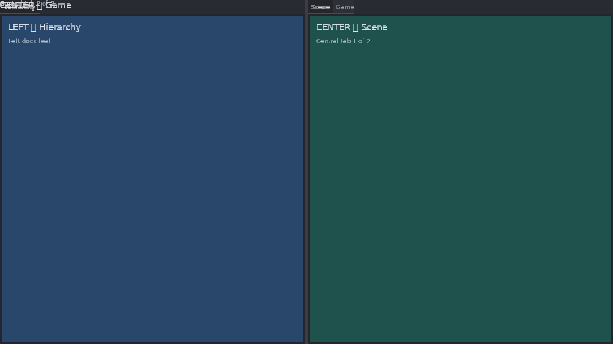
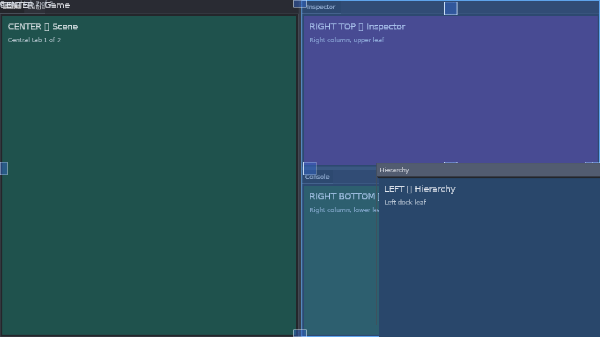
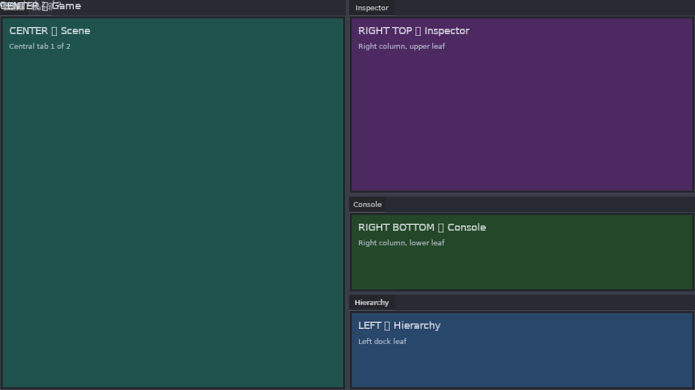
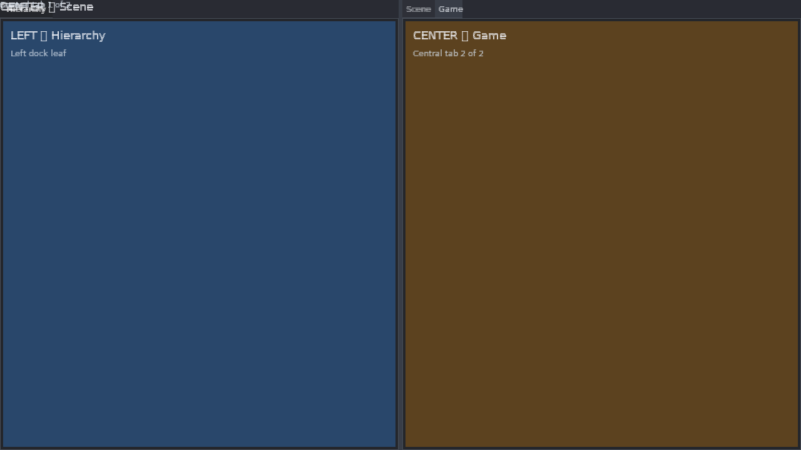
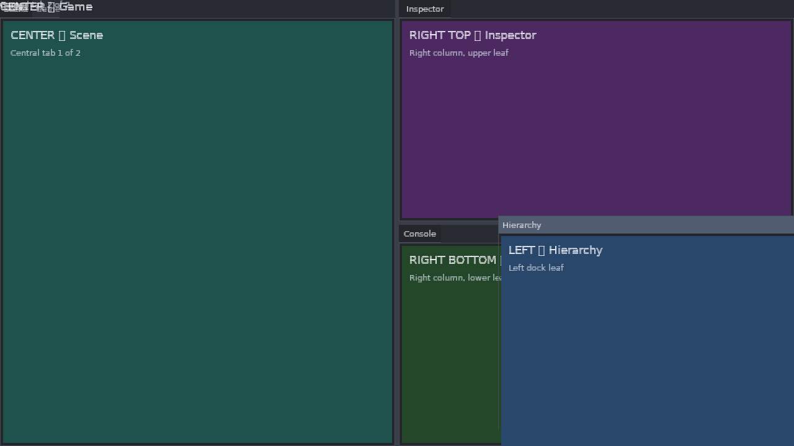
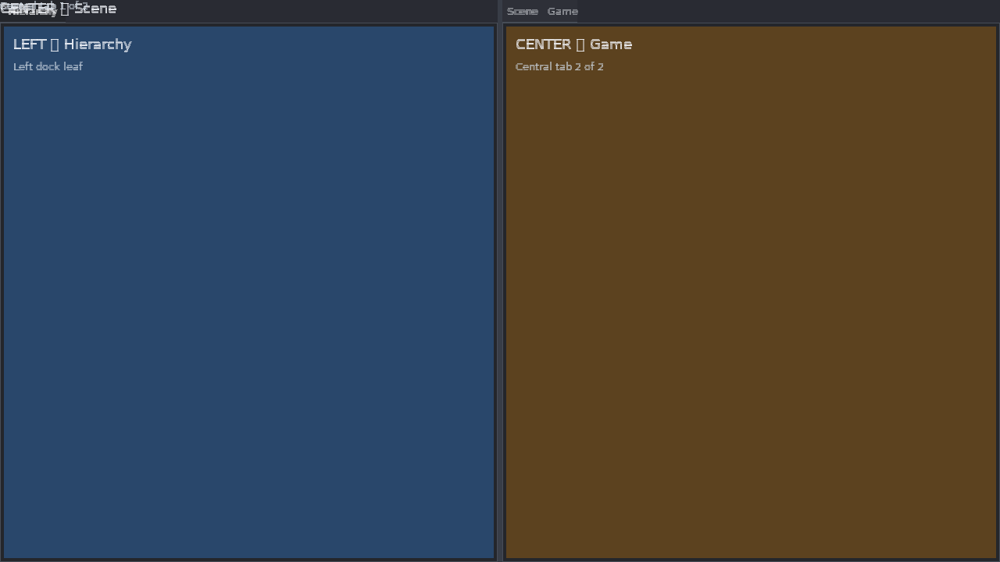
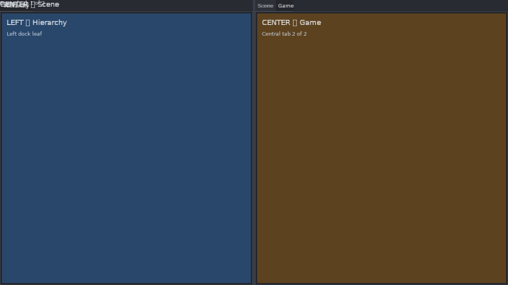

# APX-293 — Vision confirmation of docking behavior

**Ticket:** APX-293  
**Date:** 2026-08-13  
**Scene:** `sample_dock_demo_build` (same builder as `sk-player --dock-demo`)  
**Viewport:** 1280×720, content scale 1.0, soft-render harness  
**Frames:** [`docs/ui-vision-apx293-frames/`](ui-vision-apx293-frames/)  
**Measurements:** [`ui-vision-apx293-frames/notes.txt`](ui-vision-apx293-frames/notes.txt)

This is the acceptance gate for APX-293: a screenshot report, not a test suite.
No docking code was changed.

## How the demo was launched

Intended host:

```bash
cmake --build build --target sk-player
./build/bin/sk-player --dock-demo
```

Headless geometry dump **works** (no window):

```text
$ ./build/bin/sk-player --dock-demo --dump-layout | grep '^dock-demo-layout:'
dock-demo-layout: {"space":[0,0,1280,720],"left":[0,0,280.279999,720],"center":[286.279999,0,750.667114,720],"right_top":[1042.94714,0,237.052856,357],"right_bottom":[1042.94714,363,237.052856,357]}
```

Live window **does not open** in this environment:

```text
DISPLAY=  WAYLAND_DISPLAY=
$ ./build/bin/sk-player --dock-demo
… plugins loaded (6 of 6), app init complete …
exit 1
```

`sk_window_init` returns `-1` when `glfwInit()` fails (`plugins/platform_window/platform_window.c`). There is no logged GLFW error. This is a missing display backend, not a dock-model crash.

Frames below were produced from the **same** `sample_dock_demo_build` path the player uses, through the documented headless harness (`harness_create` + `soft_render` + `input_dispatch` + `harness_step`). That is the comparable-screenshot path called out in `docs/ui-plugin.md` §7.10.

Intended arrangement (README / `sample_dock.c`):

| Region | Window id | Label |
| --- | --- | --- |
| Left leaf (~22%) | `dock-demo-hierarchy` | LEFT — Hierarchy |
| Center tabs | `dock-demo-scene`, `dock-demo-game` | CENTER — Scene / Game |
| Right top (~24%) | `dock-demo-inspector` | RIGHT TOP — Inspector |
| Right bottom | `dock-demo-console` | RIGHT BOTTOM — Console |

## Check summary

| # | Check | Result |
| - | ----- | ------ |
| 1 | Initial docked layout matches the demo’s intended arrangement | **FAIL** |
| 2 | Drag in progress shows drop-target zones and preview highlight | **PASS** |
| 3 | Edge dock produces a split | **PASS** |
| 4 | Center dock produces a tab | **FAIL** |
| 5 | Tab switching | **PASS** |
| 6 | Splitter drag resizes siblings | **FAIL** |
| 7 | Undocked floating window | **PASS** |
| 8 | Layout persistence across demo restart | **FAIL** |

**Overall:** docking **model** operations (tear, undock, edge split, tab activate, persist JSON) work. The **painted** 3-column workspace does not match the model, so several visual checks fail.

---

## 1. Initial docked layout — FAIL

**Frame:** [`01_initial_layout.png`](ui-vision-apx293-frames/01_initial_layout.png)



**Expected:** three columns — Hierarchy ~22% left (280 px), Scene/Game center, Inspector stacked over Console on the right (~24%). Scene tab selected. Labels use an em-dash (“LEFT — Hierarchy”).

**Rendered:**

- Only **two** full-height panes. Hierarchy (blue) and Scene (teal) each take about half the window.
- Inspector and Console are **not on screen**.
- Clay abs rects put them **below** the 720 px viewport: Inspector `[643, 1469, 637, 328]`, Console `[643, 1832, 637, 328]`, both `node_is_visible=0`.
- Model `dockspace_layout` still reports the intended 3-column rects (`left` 280.3×720, `right_top` at x=1042.9). **Painted chrome does not match the model.**
- Painted splitter sits near x=637, not at the model 280 / 6 pt bar.
- Inactive Game heading (`CENTER □ Game`) is painted on top of the Hierarchy tab strip.
- Em-dash glyphs are missing boxes (`LEFT □ Hierarchy`).

Defects: **D1**, **D2**, **D4**, **D6**.

---

## 2. Drag in progress (zones + preview) — PASS

**Frame:** [`02_drag_in_progress.png`](ui-vision-apx293-frames/02_drag_in_progress.png)



Hierarchy tab torn off and held over the workspace.

**Expected:** drop-target zone squares and a preview highlight of the hovered dock region.

**Rendered:**

- Small blue **zone squares** are visible (Scene left edge, Inspector corners, Console bottom).
- Inspector has a **semi-transparent blue preview** wash and border (`dock-demo-drop-preview` measured 320×720).
- Torn Hierarchy is a floating window with a title bar.
- After the tear, Inspector/Console become visible (the left leaf is gone, so the remaining split fits).

Zones and preview **are** painted. Placement is messy (preview lands on Inspector rather than a clean Scene-center plate; leftover Game label on the Scene strip) but the check is met.

---

## 3. Edge dock → split — PASS

**Frame:** [`03_edge_dock_split.png`](ui-vision-apx293-frames/03_edge_dock_split.png)



**Expected:** dropping a torn window on an edge creates a new sibling leaf and a splitter.

**Rendered:** Hierarchy is redocked as a **third row** under Console in the right column (`rect [974.2, 632.2, 305.8, 87.8]`). Inspector / Console / Hierarchy are stacked with splitters. Scene stays on the left.

The drop hit the right-column down zone rather than Scene’s bottom, but the result is a real edge split.

---

## 4. Center dock → tab — FAIL

**Frame:** [`04_center_dock_tab.png`](ui-vision-apx293-frames/04_center_dock_tab.png)


**Expected:** dropping on a leaf **center** zone adds the window as a tab on that leaf (Scene + Game + Hierarchy).

**Rendered:**

- Hierarchy remains **floating** (`docked=0`, no dock node).
- Scene leaf still has **two** tabs: `dock-demo-scene`, `dock-demo-game`.
- No Hierarchy tab on Scene.

Defect: **D5**.

---

## 5. Tab switching — PASS

**Frame:** [`05_tab_switch_game.png`](ui-vision-apx293-frames/05_tab_switch_game.png)



**Expected:** clicking the Game tab shows Game content and marks Game active.

**Rendered:**

- Game tab is the selected (lighter) tab.
- Center pane fill is Game brown (`CENTER □ Game`, “Central tab 2 of 2”).
- Model `active_index` went from 0 to 1.

**Related defect (does not fail the check):** inactive Scene content still paints on the Hierarchy strip (`CENTER □ Scene`). See **D4**.

---

## 6. Splitter drag resizes siblings — FAIL

**Frames:** [`06a_splitter_before.png`](ui-vision-apx293-frames/06a_splitter_before.png) · [`06b_splitter_after.png`](ui-vision-apx293-frames/06b_splitter_after.png)


**Expected:** dragging the root splitter widens Hierarchy and shrinks the rest.

**Rendered:**

| | Model ratio | Model left width | Painted layout |
| --- | --- | --- | --- |
| Before | 0.2200 | 280.3 | ~50 / 50 (splitter ~x=637) |
| After | **0.6227** | **793.3** | **Visually identical to before** |

The model accepted the drag. Clay/paint did not apply the new sibling sizes. Defects: **D2**, **D3**.

---

## 7. Undocked floating window — PASS

**Frames:**

- On-screen float (same capture as the failed center drop): [`07b_floating_window_onscreen.png`](ui-vision-apx293-frames/07b_floating_window_onscreen.png)
- Released outside the dockspace (window follows pointer off the right edge): [`07_floating_window.png`](ui-vision-apx293-frames/07_floating_window.png)



**Expected:** an undocked window is a floating absolute overlay with title-bar chrome, not a dock leaf.

**Rendered (07b / 04):** Hierarchy is a floating window (`title` “Hierarchy”, body “LEFT □ Hierarchy”) over the Console, `docked=0`, overlay `ui-dock-overlay` present. After tear, the remaining dock is Scene | Inspector/Console.

**07** used a release at (1400, 200). The float tracked the pointer to `left=1360` (off the 1280 px workspace) and is not visible. That is pointer-follow, not a missing undock.

---

## 8. Layout persistence across demo restart — FAIL

**Frames:** [`08a_rearranged_before_restart.png`](ui-vision-apx293-frames/08a_rearranged_before_restart.png) · [`08b_after_demo_restart.png`](ui-vision-apx293-frames/08b_after_demo_restart.png) · [`08c_after_json_load.png`](ui-vision-apx293-frames/08c_after_json_load.png)






**Expected (this ticket):** rearrange, restart the demo, see the same arrangement.

**Rendered:**

| | Model left | Active center tab | Paint |
| --- | --- | --- | --- |
| 08a rearranged | 813.2 | Game | Game brown |
| 08b `sample_dock_demo_build` (player restart path) | **280.3** | **Scene** | Scene teal (default) |
| 08c `dock_layout_load_json` of the 08a blob | 813.2 | Game | Game brown (matches 08a) |

`sample_dock_demo_build` / `sk-player --dock-demo` **never** calls `dock_layout_load_json` (documented in `sample_dock.c` and README: “no persist / `.ini` restore”). Persist **APIs** work (08c). The demo host does not restore a user rearrangement. Defect: **D7**.

---

## Defects (for follow-up implementation)

Do not fix in APX-293. Each row is expected vs rendered.

### D1 — Right column painted below the viewport (initial 3-column layout)

- **Expected:** Inspector over Console in a right column inside 1280×720.
- **Rendered:** Inspector abs `[643, 1469, 637, 328]`, Console `[643, 1832, 637, 328]` — a full viewport height below the window. Initial frame shows only Hierarchy | Scene.
- **Frame:** `01_initial_layout.png`
- **Notes:** `hidden_query=1` on those windows. They become visible after the left leaf is torn off (frames 02–04, 07).

### D2 — Painted chrome ignores dock model rects / ratios

- **Expected:** painted panes match `dockspace_layout` (left 280.3 px at ratio 0.22; splitter at ~280).
- **Rendered:** painted splitter ~x=637 (~50/50). Model and paint disagree on every 3-column frame.
- **Frames:** `01_initial_layout.png`, `06a_splitter_before.png`, `06b_splitter_after.png`

### D3 — Splitter drag updates the model but not the painted siblings

- **Expected:** after drag, Hierarchy visibly wider, center/right narrower.
- **Rendered:** ratio 0.22 → 0.62 and left 280 → 793 in the model; `06a` and `06b` are visually the same.
- **Frames:** `06a_splitter_before.png`, `06b_splitter_after.png`

### D4 — Inactive tab content paints on another leaf

- **Expected:** only the active leaf tab’s body is visible; inactive windows are omitted.
- **Rendered:** `CENTER □ Game` (or `CENTER □ Scene` after switch) is drawn on the Hierarchy tab strip.
- **Frames:** `01_initial_layout.png`, `05_tab_switch_game.png`

### D5 — Center drop does not create a tab

- **Expected:** drop on a leaf center zone appends the window to that leaf’s tab list.
- **Rendered:** Hierarchy stays floating; Scene tabs remain `[scene, game]`.
- **Frame:** `04_center_dock_tab.png`

### D6 — Em-dash missing from the demo font

- **Expected:** “LEFT — Hierarchy”, “CENTER — Scene”, etc.
- **Rendered:** “LEFT □ Hierarchy” (tofu box).
- **Frames:** all demo frames.

### D7 — Demo restart does not restore a rearranged layout

- **Expected (APX-293):** rearrange, restart the demo, same arrangement.
- **Rendered:** `sample_dock_demo_build` rebuilds the default tree (08b). `dock_layout_save_json` / `dock_layout_load_json` round-trip the rearrangement (08a ↔ 08c).
- **Frames:** `08a_rearranged_before_restart.png`, `08b_after_demo_restart.png`, `08c_after_json_load.png`

---

## Launch note (not a docking-model defect)

`sk-player --dock-demo` cannot create a GLFW window when `DISPLAY` / `WAYLAND_DISPLAY` are unset. `glfwInit()` fails; the process exits 1 with no GLFW log line. Use `--dump-layout` or the harness path for headless confirmation.

## Outcome

APX-293 visual gate: **not signed off**.

Four of eight checks pass (drag preview, edge split, tab switch, floating window). The intended first-run 3-column layout, painted splitter resize, center-to-tab drop, and demo-host persistence do not.

Follow-up implementation should start with **D1/D2** (project the binary tree onto Clay so the right column is in-viewport and ratios size siblings). **D3** is the same projection bug. **D4** and **D5** are apply/DnD. **D6** is font coverage. **D7** is host policy if the demo is required to persist.
